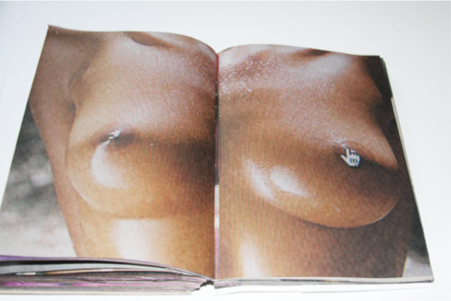

## "A/S/L?"
>“The dream of cyberculture is to leave the ‘meat’ behind and [for the subject] to become distilled in a clean, pure uncontaminated relationship with computer technology.”<a class="footnote">1Lars Lovlie, “Is there any body in cyberspace? Or the idea of a cyberbildung,” (UTBILDNING & DEMOKRATI, 2005), 116</a>

The meat of the body, the flesh, blood, and viscera are the hardware of human interface with the outside world. The software of the brain is programmed by interactions with the hardware, from the basest human desires to lofty intellectual stimulation. The software is the locus of human subjectivity, defining the self by embodied experience. The dream of cyberculture rejects the embodiment of human subjectivity, the contamination of the desires of the flesh, but, as Lars Lovlie points out, simulated reality on computers relies on the same situation and orientation as bodily experience. This is the case because there are very few other templates for experience than those of the bodily senses. Without simulating the senses of vision, hearing, touch, etc., there is no desire, no basis for interaction, just as there is no intersubjectivity without sensory exchange. The self is defined by the life span and boundaries of the body. Identity, particularly one’s gender identity, is a category of experience in which these boundaries are questioned. Many still believe that biological sex determines gender; others such as Judith Butler argue that gender is socially constructed, based on a performance of gender roles. On Internet chat forums, “a/s/l?” or “age/sex/location?” is as common a question as asking for one’s name. Knowing these qualities of an individual’s embodiment in the physical world remains a necessity for interpersonal communication online, even if the translation of the physical body into a virtual self could allow one to exceed the boundaries of their physical reality and proscribed roles. Disembodied netizens must ask themselves:

>What is the nature of my relationships? What are the limits of my responsibility? And even more basic: Who and what am I? What is the connection between my physical and virtual bodies? And is it different in different cyberspaces? These questions are framed to interrogate an individual, but with minor modifications, they are equally central for thinking about community. What is the nature of our social ties? What kind of accountability do we have for our actions in real life and in cyberspace? What kind of society or societies are we creating, both on and off the screen?<a class="footnote">2Sherry Turkle, _Life on the Screen: Identity in the Age of the Internet_, (Simon & Schuster, 1997), 231</a>

The goal of this thesis is to explore some of the answers to these questions of physical and virtual embodiment. The first chapter explores how cyberfeminist artists answer based on representations of the female body in online visual culture.

### "No Girls On The Internet?"

Regardless of the potential for a disembodied, post-identity society online, it remains evident that sex and gender identity have a discernible impact on cyber-relations. It is a common practice in chat rooms and role-playing games to gender-swap, presenting as an alternative to one’s biological sex for social or sexual purposes. The fluidity of gender online allows netizens to explore the experience of altering their gender presentation, but Sherry Turkle, who has interviewed hundreds of Internet users, also points out the ways that the elimination of the physical experience limits the extent of understanding:

>Many of the people I interviewed claimed that virtual gender- swapping enabled them to understand what it’s like to be a person of the other gender, and I have no doubt that this is true, at least in part. But as I listened to this boast, my mind often traveled to my own experiences of living in a woman’s body. These include worry about physical vulnerability, fears of unwanted pregnancy and of infertility, fine-tuned decisions about how much makeup to wear to a job interview, and the difficulty of giving a professional seminar while doubled over with monthly cramps. To a certain extent, knowledge is inherently experiential, based on a physicality that we each experience differently.<a class="footnote">3Sherry Turkle, Life on the Screen: Identity in the Age of the Internet, (Simon & Schuster, 1997), 238</a>

Since even the earliest days of the Internet, female existence in cyberspace has been categorically denied with the adage, “there are no girls on the Internet.” All users of the Internet are gendered male by default, and anyone presenting as female is considered a potential scam artist. Although female subjectivity is denied, the female body as an object of desire is ubiquitous online. Women must carefully construct their identities online, and attempts to simulate their embodied experiences are developing a new aesthetic of representation. To begin my discussion with the net art aesthetic and the aesthetic of simulation, I will explore the works of Meghan Forsyth, Krystal South, Anna Utopia Giordano, Petra Cortright, Rachel de Joode, and Jennifer Chan. The tension between two- dimensional and multi-dimensional representation parallels the tension between simulated representations of these women’s bodies and their embodied experiences offline, in the flesh. The exploration of the “selfie” illustrates how the self-portrait is deployed to represent virtual embodiment and mediate these spatiotemporal conflicts. Works by Krystal South and Jennifer Chan further illustrate the impossibility of autonomous representation, revealing the unintended audience of these artists and others’ freely circulating self-images. The following discussions of cyber-feminist net artists’ works explore the ways that female embodiment is politicized and desexualized by the assertion of a kind of female subjectivity that destabilizes conventional representations, thus redistributing pleasure, reclaiming and dismantling the body through remix and reinvention.

## The Aesthetic of Simulation

Internet artist Krystal South, who claims to have been online every day since she was twelve, has defined net artists as anyone who uses computers or the Internet in the production or distribution of their work. Her definition not only carries her authority as a native netizen, but as an artist attempting to identify herself. To use such a broad definition comprises those who write code and those who do not, those who use the Internet as their medium or simply as the conceptual background for their work performed on traditional media but containing content relating back to the Internet. Given the increasing ubiquity of computer technology in all aspects of modern life, the category of net art has expanded rapidly to include a broad range of styles. New media critic Lev Manovich defines media-specific styles in the context of art history by quoting Clement Greenberg’s comments on modernism: “‘Because flatness was the only condition painting shared with no other art, Modernist painting oriented itself to flatness as it did to nothing else.’” <a class="footnote">4Lev Manovich, _Software Takes Command_ (Bloomsbury, 2013), 120.</a>Manovich goes on to argue that the aesthetic of software is media- independent, but his main concern in creating this definition is not to theorize about art practice but about technology. He argues, “the technical ability to sample media work by others has become the basis of the key aesthetics of our time - remixing.”<a class="footnote">5Lev Manovich, _Software Takes Command_ (Bloomsbury, 2013), 122.</a> The artist’s technical ability to mix and remix various media in net art is enabled by software, but the orientation of the net art aesthetic, to continue in Greenberg’s terms, is not only towards the flatness of the screen, as in Modernist painting, but in the aesthetic of simulation which seeks to represent the rest of the world by the media available within the confines of a computer screen.

The aesthetic of simulation seeks to exceed the confines of the screen, in its attempts to simulate reality in all that takes place on and in the computer, as well as outside of it, which netizens refer to as “irl” (“in real life”) or “afk” (“away from keyboard”). The aesthetic of simulation need not be a media-specific style, but often references the medium itself in context, with such examples as software programmed to resemble paper, used for word processing. By imaging the cursor on the screen as a hand with a single pointing finger, the physical hand controlling the external mouse or track pad is digitized and disembodied, able to interact with the two-dimensional simulation. Artist Meghan Forsyth has captured the phenomenon of this interface symbolically touching the female body in a 304-page book entitled _Virtuality_, which features pixelated images of cursor “rollovers in inappropriate places.” (Figure 1.1)<a class="footnote">6Megan Forsyth, _Virtuality_, 2009, via http://meghanforsyth.com/Virtuality.html, screen capture circa 2014</a>

### Figure 1.1, Megan Forsyth, _Virtuality_, 2009

Forsyth’s images convey the paradox of the aesthetic of simulation: the lack of sensation. While the sense of vision is easily conveyed by three-dimensional animation rendering, the sense of touch is not easily digitized. Technologies are activated by our desires, and Virtuality illustrates the virtual expression of the desire for real women’s bodies, and how poorly this desire is met by the two-dimensional simulation of touch via the cursor. It also evidences the images of women most commonly accessed by this touch, those exposing their bodies’ flesh in pornography. From the examples on her website, it is clear that very few of these pictures feature the women’s faces, focusing on specific body parts and flesh textures.

Rachel de Joode’s _The Imaginary Order_ (2012) is another illustration of the tension between the three-dimensional body and the two-dimensional representation (Figure 1.2)<a class="footnote">7Rachel de Joode, _The Imaginary Order_, 2012, via http://www.racheldejoode.com, screen capture circa 2014</a>:

### Figure 1.2, Rachel de Joode, _The Imaginary Order_, 2012

>Google home screen printed on foil and mounted on glass, with the name of the artist in the search bar. This is a performance piece: a woman sits, hangs and presses herself against the glass plate and licks it. Her movements are weak, extremely slow and viscous like dough. She moves without beginning, without end. She is in a soft state, pushing her mush against the plate which becomes a wall she cannot go through. This piece is about a parallel, Google existence and the border between the physical and the imaginary. The internet offers the possibility of another kind of life, a non-physical, mechanical existence which resides separate from the body. On the internet, there is an ‘ideal’ self, a fictional self, that is not real. This parallel persona is reproduced and distributed in a place that we cannot see or grasp, and it lives and decays at a rate different than our physical selves. However, this alternate, Internet being is still a real thing, its thingness Google.<a class="footnote">8Rachel de Joode, “The Imaginary Order” http://www.racheldejoode.com/index.html 2013.</a>

In de Joode’s description of the work, her movements recall the performance of Bruce Nauman’s _Body Pressure_ by Marina Abramović as one of her _Seven Easy Pieces_ performed at the Guggenheim in 2005.<a class="footnote">9Guggenheim Museum. “Exhibitions – Marina Abramovic: Seven Easy Pieces” http://pastexhibitions.guggenheim.org/abramovic/ 2005.</a> Nauman wrote the original instructions for the piece in 1974, and it asks the performer to “Press as much of the front surface of
 your body (palms in or out, left or right cheek)
 against the wall as possible.
 Press very hard and concentrate.  Form an image of yourself (suppose you
had just stepped forward) on the  pposite side of the wall pressing
bck against the wall very hard.”<a class="footnote">10Bruce Nauman, “Body Pressure” 1974, c 2002 http://www.e- flux.com/projects/do_it/manuals/artists/n/N001/N001A_text.html</a> De Joode could be imagined to be following Nauman’s instructions, with Google representing the indexed image of herself projected into cyberspace. De Joode’s piece also recalls the work of Pipilotti Rist in _Open My Glade (Flatten)_ (2000) in which videos of Rist pressing her face against glass were projected on advertising billboards in Times Square.<a class="footnote">11Public Art Fund, “Open My Glade” http://www.publicartfund.org/view/exhibitions/5855_open_my_glade 2000.</a> In these performances, the women have as much contact with the glass surface as they can, appearing to be attempting to pass through it and ultimately failing. The visual spectacle of the flesh being distorted by the glass makes the flesh and the performer part of the art object. In Abramović’s case, this distortion of the flesh and the sensations of her body are emphasized by Nauman’s voice directing her actions, in what “may become a very erotic exercise.” Rist’s work uses similar imagery, but in the context of a billboard, she describes it as “advertisements for emotion.” Rist appears to be struggling to escape the glass of the screen, not to merge with it, but to pass through and make contact with other human bodies. In de Joode’s case, there is also a hypothetical body implied on the other side of the glass that is made of the aggregate of data referring to her on Google.

De Joode’s work shows how attempts to merge or unite the corporeal self with this hypothetical body are physically impossible without shattering the glass surface of the computer screen, as it is impossible to touch ones reflection through the surface of a mirror. The difference between the mirror subject and the screen subject, however, is that the screen subject reflects only the image of the self that is created by interfacing with the computer. Hayles writes, in _How We Became Posthuman_, “the overlay between the enacted and the represented bodies is no longer a natural inevitability but a contingent production, mediated by a technology that has become so entwined with the production of identity that it can no longer meaningfully be separated from the human subject.”<a class="footnote">12Katherine Hayles, _How We Became Posthuman: Virtual Bodies in Cybernetics, Literature, and Informatics_. (University of Chicago Press, 1999) xiii, via Jones, 44.</a> If the “overlay” and the “mediator” are seen as the glass between de Joode’s real and cyber self, the computer screen is part of her cyborg body and the tension between her flesh and its in-screen counterpart is a tension between de Joode and a part of herself. In de Joode’s case, by explicitly implicating Google Inc. as the artist behind the representation of her cyborg body, she questions how accurately it reflects her identity.

### Flesh and Commodification

Further commentary on the state of digitized female flesh can be found in the work of Krystal South, who created a website referring to Marcel Duchamp’s _L.H.O.O.Q._ of entirely butt-shaking animations<a class="footnote">13Krystal South, http://www.krystalsouth.com/lhooq.html, 2009</a> and Anna Utopia Giordano, who has digitally retouched masterpieces to conform to the beauty standards of popular culture.<a class="footnote">14Anna Utopia Giordano | Venus, http://www.annautopiagiordano.it/venus-ita.html, 2012</a> South’s use of found .gif files in her reference to Duchamp seems particularly apt, as the piece she is referencing was a postcard-sized reproduction of the _Mona Lisa_ defaced by Duchamp by the addition of a moustache, goatee, and the caption “L.H.O.O.Q.,” homophonous in French with “She has a hot ass.” The valuation of the sexualized posterior in digital images of women is illustrated by the widespread availability of these short, looping images, which consist only of rippling flesh. Giordano’s project shows an opposite mutation of female bodies by digitization. As she presents her _Venus_ project on her website, she shows a side-by-side comparison between various artists’ depictions of the goddess Venus from Botticelli to Velasquez, and gives them all the same digital treatment with Photoshop as real women’s bodies receive in popular media: an overall shrinking effect, emphasizing the roundness of their breasts and hips while eliminating all other fleshy protrusions: a distillation of the signifiers of femininity, without the burden of female subjectivity or corporeal existence. For a modern version of Venus, this embodiment seems appropriate to provide an updated image of the goddess who is in opposition to Donna Haraway’s cyborg subject. The dichotomy between the cyborg and goddess is mediated in this case by the fact that Giordano’s Venuses are also cyborgs, by nature of their bodies being digitally manipulated.

Petra Cortright’s website<a class="footnote">15Petra Cortright, http://www.petracortright.com</a> is an excellent example of net art which illustrates both the use of two-dimensional, specifically digital forms of communication, and images of bodily experience. Her art works take the form of videos and expose her embodied experience through various technological filters. Cortright refutes the “no girls on the Internet” rule, because her presentations of herself are exactly that: a girl, with a webcam. For videos such as _SICKHAIR & SICKHANDS_ and _RGB, D-LAY_ (Figure 1.3)<a class="footnote">16Petra Cortright, _RGB, D-LAY_, 2011, via http://www.petracortright.com/rgbdlay.html screen capture circa 2014</a> she uses an image manipulation software for the web cam called Magic Camera and plays with her hair and hands’ effects, producing cascades and rainbows of afterimages.

### Figure 1.3, Petra Cortright, _RGB, D-LAY_, 2011

For many net artists, their intent is to obscure the sign and referent through the remix, digitally manipulating images until they are unrecognizable. Petra’s image is not obscured in her videos, she uses the special effects to ornament or enhance her digital presence, emphasizing her physical existence. She is a conventionally beautiful woman and uses her face and body in her videos to perform femininity, often dancing, modeling, or simply displaying herself for the webcam against the background of her home or a digitally rendered scene of an entirely different environment, for example a beach, placing her body in cyberspace. According to her page on the Steve Turner Contemporary site, a gallery site where her videos are displayed for sale, she has been making webcam videos since 2007 and made the decision herself to correlate the prices of her videos with the number of views they receive on YouTube.<a class="footnote">17Petra Cortright Video Catalog, Steve Turner Contemporary http://steveturnercontemporary.com/petra-cortright-videos/</a> Both the clicks and current prices of her art are in the $1,000.00+ range. Her own commodification of herself in her videos is not very different from what teenage girls across the country are doing without profiting. By using software to create a marketable, digitized self-image and cashing in on the clicks and the attention she receives, Cortright makes a powerful statement about her ability to control the commodification of these carefully constructed images. Through her own digitization, capitalizing on her bodily femininity, as in South’s project, and digitally enhancing it as an artistic practice, like Giordano, her art practice instantiates the commodification of female sexuality in the twenty-first century. As in their corporeal existence, young female bodies in cyberspace are objectified as commodities, often in bizarre and unexpected ways.

### Selfies, Self-Reflection

Krystal South implies the metaphor of a computer screen as a mirror by quoting Michel Foucault on her personal website www.krystalsouth.com. He writes,

>The mirror is, after all, a utopia, since it is a placeless place. In the mirror, I see myself there where I am not, in an unreal, virtual space that opens up behind the surface; I am over there, there where I am not, a sort of shadow that gives my own visibility to myself, that enables me to see myself there where I am absent: such is the utopia of the mirror. But it is also a heterotopia in so far as the mirror does exist in reality, where it exerts a sort of counteraction on the position that I occupy. From the standpoint of the mirror I discover my absence from the place where I am since I see myself over there. Starting from this gaze that is, as it were, directed toward me, from the ground of this virtual space that is on the other side of the glass, I come back toward myself; I begin again to direct my eyes toward myself and to reconstitute myself there where I am. The mirror functions as a heterotopia in this respect: it makes this place that I occupy at the moment when I look at myself in the glass at once absolutely real, connected with all the space that surrounds it, and absolutely unreal, since in order to be perceived it has to pass through this virtual point which is over there.<a class="footnote">18Michel Foucault, “Of Other Spaces, Heterotopias” _Architecture, Mouvement, Continuité_ 5 (1984): 46-49. http://foucault.info/documents/heterotopia/foucault.heterotopia.en.html via www.krystalsouth.com</a>

In the essay _IDENTIFY YOURSELF_ South writes about collective and personal experiences of subjectivity on the Internet and how Foucault’s conception of the heterotopia, a liminal space for perceptual shift, is expressed online. The format of the essay is a website called idyrself.com, featuring two columns of text interspersed with moving and static images. The left side, under “IDENTIFY” is concerned with the collective experience of life on the Internet and “YOURSELF” is written from South’s perspective. The two columns are of different lengths and scroll at different speeds, discouraging the reader from attempting to read them simultaneously. Key passages in each column are highlighted wherever the essays’ subject matter converges, and a third column between them contains links to relevant net artworks.

Under the heading of “THE GAZE,” in “IDENTIFY,” South explicitly writes, “The Internet is a mirror,” and within this text provides a hyperlink to www.theinternetmirror.com, a website with an orange and gold wallpaper background and a golden frame. If the user allows the site to connect with their webcam, the site functions as a mirror within the frame, showing the user themselves through the eye of the webcam. Highlighting the words, “We are putting forth, creating and contributing, and participating in systems from which we receive feedback,” under “IDENTITY,” she pairs this idea in the “YOURSELF” column with the statement: “We can eliminate unsightly feedback as easily as we can create the content that garnered it. This process of self-editing is not new, but in the age of screen-caps, with the amount of attention people expend grooming their digital feeds, monitoring these streams seems equally important.”<a class="footnote">19Krystal South. “IDENTIFY YOURSELF” idyourself.com, 2013.</a> This point is illustrated by an anecdote she provides about finding pictures of herself on a fetish website devoted to pictures of women cutting their own hair. She writes, “The most banal selfies become the pornography of the diverse fetishist.” South admits there is nothing she can do about the redistribution of her image. She writes, “I found this simultaneously appalling and hilarious. I could take the images down from Flickr, thus ending their fun, but knew that if people really got off on these images, they had probably already downloaded them to their personal archives. So I left them, because that’s just how the Internet plays out.”<a class="footnote">20Krystal South. “IDENTIFY YOURSELF” idyourself.com, 2013.</a>

As mentioned, it has become increasingly common for netizens to project their physical embodiment into cyberspace by means of self-portraits taken with web cameras, and a cultural dialogue around the concept of the “selfie” has come up in response. The Oxford English Dictionary made “selfie” their word of the year in 2013, and define it as “a photograph that one has taken of oneself, typically one taken with a smartphone or webcam and uploaded to a social media website.”<a class="footnote">21Oxford Dictionaries “Word of the Year 2013” http://blog.oxforddictionaries.com/press- releases/oxford-dictionaries-word-of-the-year-2013/, 19 November 2013</a> The dialogue centers mainly on the millennial generation and attacks them for being self-absorbed and narcissistic. The criticism of narcissism reflects the conception of the computer screen as a mirror, and expresses disapproval with the amount of time young people spend interacting with technology, interpreting it as a form of self-obsession. An article called “Everything is Embarrassing: Finding an Audience for Teen Angst Years Later” republished by Laura Marie Maciano on _alt crit_, a collectively authored art criticism blog, points out the gendered nature of these criticisms. It refers to an article by Alicia Eler and Kate Durbin on the “Teen Girl Tumblr-Aesthetic,” described as “an abundance of raw, sparkling, vulnerable and honest accounts of visuals, writing, and moving gifs, which more often than not, center around their bodies, self images that represent where the emotional and physical landscapes of ‘girl world’ meet the concrete flesh of phallic (gross) reality.”<a class="footnote">22Laura Marie Marciano, ed., Alt crit. “Everything is Embarrassing: Finding an Audience for Teenage Angst Ten Years Later” (Iconno Magazine, 2013).</a> This is the same aesthetic that Mary Bond of www.selfiemary.com calls “girlcore,” that is described as “an art ‘philosophy’ which basically holds at its center an unapologetic expression of and admiration of young female subjectivity.”<a class="footnote">23Mary Bond, “GIRLCORE: RADICAL NARCISSISM, EXPRESSIVE HONESTY AND MACABRE SEXUALITY,” 2012 www.selfiemary.com</a> This aesthetic is to be found wherever young women can express themselves online in large groups, from blogs to social media.

Sarah Gram models the experience of young girls in a critique of capitalism on her blog “Textual Relations.” Gram recalls how, in a discussion of the selfie, “two adult men laughed out loud at the idea that young women’s bodily experiences under sexism might play a role in the evaluation of the selfie’s moral status.” She argues that the commodification of women’s bodies that young girls are socialized to accept in a capitalist society necessitates these “narcissistic” actions as a standard for their performance of femininity. Arguing that the selfie is the product of gendered labor under capitalism, she points out that the disgust reaction is evident of hegemony: “We elevate the work women do on their bodies to the utmost importance, and then punish the outcome of that labour [sic].”<a class="footnote">24Sarah Gram, Textual Relations. “The Young-Girl and the Selfie” http://text- relations.blogspot.ca/2013/03/the-young-girl-and-selfie.html, 2013.</a> Although narcissism is commonly thought of as a perverse self-love, as in the Greek myth of Narcissus, the psychoanalytic tradition defines it as:

>a personality so fragile it needs constant support. It cannot tolerate the complex demands of other people but tries to relate to them by distorting who they are and splitting off what it needs, what it can use. So, the narcissistic self gets on with others by dealing only with their made-to-measure representations. These representations (some analytic traditions refer to them as ‘part objects,’ others as ‘self- objects’) are all that the fragile self can handle.<a class="footnote">25Sherry Turkle, _Alone Together: Why We Expect More From Technology And Less From Each Other (Basic Books, 2011)_, 177</a>

Turkle argues from this psychoanalytic perspective that the millennial generation has been accommodated by technology to use and discard these representations of themselves and others through social media. Widespread narcissism of this kind may be detrimental to society, but in the selfie’s function as part-object or self-object is exactly what the young girl needs to function in cyberspace. She is continually provided with social capital in exchange for the validation of others, even if it means creating alternate identities to be consumed and discarded. The selfie represents an identity that is only the same (the Latin root of the word “identity” being _idem_, “the same”<a class="footnote">26Heidi J. Figueroa Sarriera, “Connecting the Selves: Computer-Mediated Identification Processes” _Critical Cyberculture Studies_ Silver and Massanari, eds. (New York University Press, 2006), 97</a>) as the selfie taker because they share the same appearance; they are not the same entity. This disjunct is similar to the one expressed by de Joode’s _Imaginary Order_. Mary Bond, in a response to Gram’s “The Young Girl and the Selfie,” points out how identity is reduced to physical appearance when “we treat their bodies as extensions of themselves and commodify them... they are compressing her humanity into her physical self.”<a class="footnote">27Mary Bond, Alt crit. “Re: The Young Girl and the Selfie” http://altcrit.tumblr.com/post/48731963433/re-the-young-girl-and-the-selfie, 2013.</a> To quote another of Bond’s sites, autodissociate.me, which is wallpapered by her selfies and peppered with thoughts about self-representation, “there’s less freedom in a way, because every action is documented... you can’t ever escape your past aesthetic... kind of ironically, the superficial becomes fundamental.”<a class="footnote">28Mary Bond, autodissociate.me</a> Marciano, in “Everything Is Embarassing,” points out that in her own adolescent experience she felt that her Internet activity was a product of her isolation and that it was performed in a vacuum, without the knowledge she has now that all of the content she contributed could be consumed by others. As Krystal South writes, “My loneliness, stemming from alienation, drives me to the most open space.”<a class="footnote">29South, idyrself.com, 2013.</a> It is clear to South and Durbin, who curates the blog “Women As Objects”<a class="footnote">30http://womenasobjects.tumblr.com</a> that these young girls’ self-expressions are not private, and the youth are being made increasingly aware of how their online presence will affect their lives “irl” and “afk.”

As the real body is translated into the virtual by means of self-portraiture, it is taken at, pun intended, face value as the identity of the individual it resembles. A definition of identity that relies only on the physical appearance is all too common in a male-dominated cyberculture where women are defined by their bodies. Furthermore, now, not only do they have to be aware of the perception of their physical bodies, but also of the cyber body, which others can manipulate. When the images used by women for their own self-representation are redistributed by pornographers, they reveal the economy of images online, which is powered by the desires of the male gaze.

### Fetishized Objects

William J. T. Mitchell quotes Oliver Wendell Holmes describing the “capitalist political economy of the photographic image” in the context of the stereograph, as “expeditions of visual conquest and plunder.”<a class="footnote">31William J. Mitchell, “Intention and Artifice” _The Reconfigured Eye: Visual Truth in the Photographic Era_ (The MIT Press, 1992), 56.</a> Holmes describes the capture of photographs in the language of hunting, or more aptly pointed out by Mitchell, poaching: “Men will hunt all curious, beautiful, grand objects, as they hunt the cattle in South America, for their skins, and leave the carcasses as of little worth.” Collecting the skin, the outer surface light is reflected off of to produce the photographic image, and abandoning the body. Poaching is an appropriate metaphor for stealing or appropriating embodiment in analog photographic form, and digital photography is even easier to reproduce and re-appropriate. Mitchell moves from Holmes’ description of the economy of images to a Marxist critique and ends with Susan Sontag’s critique of the capitalist use of images: “It needs to furnish vast amounts of entertainment in order to stimulate buying and anaesthetize the injuries of class, race, and sex. And it needs to gather unlimited amounts of information, the better to exploit natural resources, increase productivity, keep order, make war, give jobs to bureaucrats.”<a class="footnote">32William J. Mitchell, “Intention and Artifice” _The Reconfigured Eye: Visual Truth in the Photographic Era_ (The MIT Press, 1992), 56.</a> In this quotation from Sontag and throughout Mitchell’s chapter the focus is primarily on how the technology of photography and photographic image distribution has caused these social effects, but Sontag’s quote still rings true if applied to the Internet and digital media distribution as well. In the case of online media, “vast amounts of entertainment” would likely refer to the billions of fetishized images of female bodies constantly circulating in pornographic images and videos, which exacerbate the injuries of class, race, and sex.

Net artist Jennifer Chan exposes the phenomenon of Internet fetish communities in a series of videos called _CRUSHES_. They are a set of five videos uploaded to YouTube in 2010 explicitly intended for fetishists who are sexually stimulated by watching women step on things in heels. These videos, taken out of a pornographic context, are bizarre pieces of performance art. They reduce women’s bodies to objects in a context in which objects are symbolically destroyed. If the objects are taken as an extension of the female body, or the body of the viewer, they illustrate the messy combination of desire and inanimate object, which is a predominant theme in most modern pornography. In the video, she seductively steps on a wheel of brie wrapped in bubble wrap and doused in crème de cacao in stirrup leggings and black heels in “\*birthday blow trample\*: brie and bubblewrap.” The video shows her blowing up a balloon (definitely another fetish object) and microwaving the brie before wrapping it up. This gesture in particular is out of place in the context of this video, as the viewers are there to see the food destroyed, not prepared, but it is also worth noting here that food preparation is considered a woman’s traditional role. Chan’s performance is sexualized by the way the camera focuses on only her legs and feet as she steps on the bubbles, avoiding the brie at first, teasing the viewer with how close her feet get to it before demolishing the cheese. According to YouTube, it has been viewed over 8,000 times, but has only a single comment: “sexy leggins and shoes awesome vid.” Despite the lack of commentary, the intended audience has clearly been reached based on the view count, which has clearly been inflated by a small group of fetishists sharing and replaying it. In “an inquiry into the tensile strength of sealed bags,” which has over 7,000 views, she steps on plastic bags full of air in red heels and a commenter requests: “sit on a unopened bag of chips.”

In “paper crush,” a man tramples and compresses paper with his body. This video, featuring Johnson Ngo as the main actor instead of Chan, has less than 300 views and no comments at all. This huge discrepancy in viewership leads me to argue that it is Ngo’s male body that the viewers are not interested in, despite the crushing action. It is Chan’s female body and its interactions with the objects that the crush fetishists are most interested in, not only the manipulation of objects by specific bodies, but the manipulation of specific bodies as objects. The fourth video of the series, “1190 calories,” has only 399 views and a single line of description: “59g fat.” In this video, Chan spreads peanut butter onto slices of bread, stacking half a loaf into a tall sandwich tower for the first four and a half minutes of the video, and then squishes it down with her hand. Based on Chan’s statements in other videos about her relationship with her body, and the conversion of nutritious food objects into numbers of calories and fat grams, this video was not intended for the same audience as the other crushes, and also carries a personal statement about her relationship with her body and the objects she must consume, or destroy, to maintain or destroy herself. She has been inundated with the same images of women referenced by South and Giordano in the “Flesh and Commodification” section, in which the female body is valued for the amount of flesh on it or absent. Nonetheless, it is available for consumption to a community of fetishists and receives a comment from user “bradley williams” requesting, “please do 1 with a pack of hamburger buns.”

The last video, “trample redux,” is the ultimate anti-crush video. She appears to be crushing something with her feet, but the camera only shows her from the knees up, focusing on her impassive facial expression. This video is only a minute and a half long, and ends with Chan laughing into the camera for the last ten seconds. The viewer perceives that she is laughing at them, laughing at her own joke, her own wildly successful entrapment of Internet fetishists, if they have bothered to watch the video until the end (and 4,700 have). It is clear from her position as a video artist that she is aware that these videos are being distributed, and by publicly uploading them on YouTube, she consents to their accessibility. However, this is not always the case in cyberspace, as evidenced by the struggles of South and de Joode to maintain control over content that also contains their embodied experiences. By connecting with just a few fetish groups, Chan makes them visible as the audience of her work by ensnaring them with her own self-produced image, intentionally inserting her body as an object into a very specific formula for erotic experience, in which it is clear she has no experience of desire. She expresses desire only to manipulate and destroy the objects around her. The commentaries on her own body image struggles embedded in the context of her pornography were no doubt lost on most of her viewers. In this set of videos and many others, Chan subversively represents female subjectivity by exposing herself and imposing a subtle commentary on a codified form of female representation.

## Woman's Culture: Cyberfeminism

In his 1991 essay “The Aesthetics of Disappearance,” Paul Virilio quotes the following phrase from Walter Benjamin: “‘We know nothing of woman’s culture, just as we know nothing of the culture of the young.’”<a class="footnote">33Steve Redhead, ed., _The Paul Virilio Reader (European Perspectives: A Series in Social Thought and Cultural Criticism)_ (Columbia University Press, 2004), 59.</a> Virilio goes on to draw his own comparisons between women and children, specifically hysterical women, but this quote of Benjamin’s out of context still rings true as a feminist statement about popular culture: mainstream culture remains male-dominated, created majorly by and in the interests of entertaining men who know nothing of women’s culture. In a later (1997) essay, “From Sexual Perversion to Sexual Diversion,” Virilio fears for the future of the human race due to the interventions of technology and “cybersexuality.” Beginning the essay by lamenting the transformation of the “woman-object” into the “object-woman,” he ends it by quoting cyberfeminist discourse from 1994. Excerpting only his quotes from the cyberfeminists of the early ‘90s, this article brings up many of the arguments cyberfeminists remain in dialogue with today about technological means of embodiment:

>Cyberfeminism participates in the development of a feminist consciousness and emphasizes the importance of the multimedia in perception of the body... Who will in future generate the codes and the specifications by which bodies will be represented in cyberspace where everything exists as metaphor? This already depends on the matter in which cybernauts choose to engage with the virtual body... What will happen to the social relationships of sexuality, the body’s sexual modes of communicating, desire and sexual difference in the age of the coded metaphor? Control of interpretation of the body’s boundaries is a truly feminist issue... It is urgent that women participate in the construction of cyberspace by developing a cyberimaginary capable of becoming a tool of their own self- construction. If it is true that the multimedia can be a formidable instrument of control and subjugation, it is up to us women to turn it into a tool of emancipation.<a class="footnote">34Steve Redhead, ed., _The Paul Virilio Reader (European Perspectives: A Series in Social Thought and Cultural Criticism)_ (Columbia University Press, 2004), 187-188.</a>

Virilio fears, in his own commentary, that cybersex will prevent the perpetuation of our species, but it seems that the cyberfeminists he quotes had slightly different goals. To a contemporary reader, the shifts in sexual and cultural identities the cyberfeminists speak of aspire to a desexualization of women’s physical bodies, not because feminists want to eliminate sexual reproduction, but because they want to exercise their ability to control their sexuality representationally as well as biologically. To control how they are perceived in cyberspace is a feminist response to the cultural oversexualization of women’s bodies and the disempowerment experienced by women who are not in control of their own representation. The cyberfeminist project to reinvent female sexuality online as a free, un-subjugated sexual subjectivity, is evident in the practices of female net artists such as Chan, South, Cortright, and many others who perform female embodiment in their Internet art. The control or lack thereof that they wield as artists over the representation of their physical bodies and the bounded or unbounded cyber-constructs they use to extend their subjectivities into cyberspace are emblematic of the struggles netizens face as their subjectivity is mediated by technology that is controlled by corporate interests and larger hegemonic power structures.

At the end of the article, “Who invented Surfing the Internet?” librarian and long- time netizen Jean Armour Polly (also known as “Net-mom®”) reflects on the terms in use before “surfing” the net became the norm: “Before we surfed the net, folks mined it, navigated it, explored it, used it, or cruised it.”<a class="footnote">35Jean Armour Polly, “Who invented Surfing the Internet?” http://www.netmom.com/about-net-mom/23-who-invented-surfing-the-internet 2006.</a> These are the linguistic signifiers of the colonialist perspective extending beyond physical space and culture and into the discourses of cyberspace, most of which have disappeared through disuse. Throughout these critiques, the possibility of the selfie as a tool for empowerment is largely discredited, because it is seen as a product of capitalist and sexist hegemony. As Bond puts it, the availability of options in a capitalist society is false freedom. Freedom of representation within selfies themselves is one issue, but a larger issue seems to be how these selfies, the embodied identities of thousands of young girls, are commoditized and distributed. As evident from South’s example, their commodification is highly sexualized. The content creators have very little control over the distribution of their images once they are available to the public on the Internet. A more effective critique of the selfie implicates not only those who create them, but those who collect and redistribute them.

This is the actual result of the cybersexuality Virilio’s feminists described. Their question of what will happen to the social relationships of sexuality, communication, desire, and sexual difference is answered by the ubiquity of pornography on the Internet and the thousands of communities uniting fetishists of all kinds. The notion that women would be able to control the use of their representation in cyberspace has proven nearly impossible if they choose to participate in an embodied way. To quote Peter Lyman in Douglas Davis’ “The Work of Art in the Age of Digital Reproduction”:

>A computer is both an object, a machine, and a series of ‘congealed’ social relations which have been embedded within the object: it is a tool which makes the work of writing more efficient; its software contains a cybernetic model of knowledge derived from technical culture which does not address the ethical and social issues which have been part of the project of qualitative social research; it is embedded within an everyday male culture of aggressive images of control which constitute a cultural barrier for some users.<a class="footnote">36Douglas Davis “The Work of Art in the Age of Digital Reproduction (An Evolving Thesis: 1991-1995)” _Leonardo_, Vol. 28, No. 5, Third Annual New York Digital Salon (1995), 382</a>

The struggle against this embedded cultural programming, which is imposed on cyberculture and on the body of the netizen, is the project of cyberfeminist artists.

### Feminizing The Network

In the same year that Virilio published his fears of cybersex, Anne de Haan circulated an essay entitled “The vagina is the boss on the internet.” She describes the work of seminal cyberfeminist net artists, including an Australian female artist group called “VNS Matrix” (parsed by Haan as “VNS – VeNuS - Matrix”) who were pioneers of the cyberfeminist movement. In conclusion, she states, “These feminist artists see the internet as an opportunity to be the boss on the internet. They do not want to lose their gender, but they want to gain dominance over the male in their female glory. The gender identity should therefore be emphasized according to them.”<a class="footnote">37Anne De Haan <sigorney {AT} knoware.nl>. “Translation: The vagina is the boss on internet.” (nettime, 1997) http://www.nettime.org/Lists-Archives/nettime-l- 9706/msg00111.html</a> Indeed, the female body is the source of power, specifically the genitals, according to the VNS Matrix manifesto titled _All New Gen_ (1995). The text of the manifesto appears on a sphere bulging out of a pink patterned background of empty ovoids with pinched edges and radiating lines surrounding them resembling hairs, seeming to represent a cartoon vagina. The manifesto reads:

>we are the modern cunt / positive anti reason / unbounded unleashed unforgiving / we see art with our cunt we make art with our cunt / we believe in jouissance madness holiness and poetry / we are the virus of the new world disorder / rupturing the symbolic from within / saboteurs of big daddy mainframe / the clitoris is a direct line to the matrix / the VNS MATRIX / terminators of the moral code / mercenaries of slime / go down on the altar of abjection / probing the visceral temple we speak in tongues / infiltrating disrupting disseminating / corrupting the discourse / we are the future cunt<a class="footnote">38Media Art Net, “VNS Matrix: All New Gen” http://www.medienkunstnetz.de/works/all-new-gen/. Accessed October 2013.</a>

While the language of this manifesto is militant and aggressive, the aesthetic is typically feminine, and does not assault the eyes of the viewer. The angry “cunt” referred to in the text is rendered as a pleasing background pattern which is distorted as the background is ruptured by the sphere, further evoking the imagery of birth. The play of aggressive textual statement of intent with contradictory hyper-feminized images seems evident as a subversive aspect of the aesthetic of cyberfeminism. As Jennifer Chan points out in her essay, “Why Are There No Great Women Net Artists?” early cyberfeminists appropriated misogynist terms such as “cunt” for the purposes of their manifestos and acted antagonistically towards masculine technological culture, creating their own websites and mailing lists to stake a claim in cyberspace.<a class="footnote">39Jennifer Chan, “Why Are There No Great Women Net Artists? Vague Histories of Female Contribution According to Video and Internet Art” (pooool.info, 2011) http://jennifer-chan.com/index.php?/writing/no-women-net-artists/</a> The vagina is used in the text as a synecdoche for the whole woman and as her eyes and hands, the body parts that interact with the world and observe or create art objects. The explicit threat of infection is one of technologic and bodily consequence, as well as the probing and infiltration that threaten to penetrate the systems of male domination. The vagina is both modern, present now at the beginning of the manifesto, and represents the tool of the future as the ultimate anti- phallic symbol. If the cyberfeminists intend to take control of the Internet with the power of the vagina, they intend to feminize even the network itself.

As Sadie Plant states in her reflections on women and virtual reality, “Cybernetics is feminization.”<a class="footnote">40Sadie Plant, “Feminisations: Reflections on Women and Virtual Reality” _Clicking In: Hot Links to a Digital Culture_ Lynn Hershman Leeson, ed. (Bay Press, Seattle: 1996), 37</a> She connects the idea of femininity as already cyborg, a masculine ideal of woman as equal parts natural and artificial, to women’s suitability to virtuality. She argues that masculine identity is threatened by technology, likening it to a self-aware system tracing the emergence of cyberspace from a tightly controlled capitalist, military technology to a rapidly expanding and all-consuming information network. Gendering this network, or matrix, as feminine she writes: “Intended to serve man’s quest for planetary domination and escape from the corruptions of the troublesome meat, the matrix was always having him on... The matrix has in any case hacked into all self- conscious attempts to shape it in man’s image of nature and artifice.”<a class="footnote">41Sadie Plant, “Feminisations: Reflections on Women and Virtual Reality” _Clicking In: Hot Links to a Digital Culture_ Lynn Hershman Leeson, ed. (Bay Press, Seattle: 1996), 38</a>  VNS Matrix’s bitch mutant manifesto, published in 1996, graphically illustrates a similarly anthropomorphized idea of the Internet as a dangerous girl child: “The net’s the parthenogenetic bitch-mutant feral child of big daddy mainframe. She’s out of control, kevin, she’s the sociopathic emergent system. Lock up your children, gaffer tape the cunt’s mouth and shove a rat up her arse.”<a class="footnote">42VNS Matrix, bitch mutant manifesto (1996) http://www.obn.org/reading_room/manifestos/html/bitch.html</a> The violence implied in the last line betrays the bodily conception of a female Internet, defined by its orifices, and the castrative threat it imposes to masculinity and the patriarchal structures by which it was created. As Donna Haraway writes, “The main trouble with cyborgs, of course, is that they are the illegitimate offspring of militarism and patriarchal capitalism, not to mention state socialism. But illegitimate offspring are often exceedingly unfaithful to their origins.”<a class="footnote">43 Donna Haraway, “A Cyborg Manifesto Science, Technology, and Socialist-Feminism in the Late Twentieth Century” _Simians, Cyborgs and Women: The Reinvention of Nature_ (New York; Routledge, 1991), 149 -181</a> The project of cyberfeminist artists is therefore to destroy the socially detrimental aspects of the Internet from the inside, by aggressively saturating it with femininity. If the network itself is seen as female, what of its creators who thought it was made in their image?

Jennifer Chan’s cyberfeminist art explicitly implicates these patriarchal power structures in a video from 2008, entitled _XXX-TRA CREDIT! XXX! \*A TOTAL JIZZFEST!\*_ (Figure 1.4)<a class="footnote">44 Jennifer Chan, _\*A Total Jizzfest\*_, 2012
via http://www.jennifer-chan.com/extra.html, screen capture circa 2014</a> The title implies a “risky click,” or pornographic content “NSFW” (“Not Safe For Work”), and leads to http://www.jennifer-chan.com/extra.html. Her encoding of the title of the work in the language of Internet pornography points to the male-dominated, capitalist underpinnings of the net as we know it. Chan’s graphics fly out of a blue background, which then transforms into a space scene common to the backgrounds of Apple computers. The graphics materialize using a transition mode not unfamiliar to users of Microsoft Power Point presentations, and the downtempo electronic muzak providing the score for her flying slideshow makes the atmosphere Silicon Valley business casual. Chan’s logo “HOT CREATIONS” materializes first, fading into a diagram of a peer-to-peer network. Text reading “THE BEST SELECTION” rolls across the middle of the image in sunset pastel colors, pointing to her process of choosing images available on the Internet for this project, and the language of advertising inherent in images produced for marketing purposes.

### Figure 1.4, Jennifer Chan, _\*A Total Jizzfest\*_, 2012

The rest of the video satirizes the images of the men who created the Internet for scientific, militaristic, but mostly capitalistic purposes. Various pictures of men seated at computer terminals flash by, and portraits of men important to the history of computing begin to predominate. The logo of “CSnet international,” flashes by, followed by a black and white picture of men at computer terminals in a lab, subtitled “OGs” (for “Original Gangsters,” presumably). A man sitting in front of terminals bearing the “W3C” (“World Wide Web Consortium”) appears. The space scene in the background has at this point been replaced with an animation of money falling through the air. The men’s images bear the names of the websites they are known for or have profited from, including gawker, eBay, and megaupload, with cute nicknames assigned by Chan such as “study buddy” for Facebook creator Mark Zuckerberg. After the first minute of video it takes a turn for the surreal. The electronic music features steel drums and a sample repeating the words, “so real, so real,” as a 3-D rendering of a beach scene with the sky torn open pans down into a virtual landscape where animated girls in bikinis dance with their hands to the sky. An image of Bill Gates reclining on a Microsoft computer partially overtakes the digital landscape and a beam of light streaming out of his forehead towards the viewer obscures the image, before he is replaced by another series of technological pioneers, including a very young Steve Jobs holding an apple. The words “people tend to think the only thing on your mind in your twenties is sex and money” scroll across the screen followed by: “ALL DAY LONG I THINK ABOUT SLEEP.” After letting the electronic music build up and wind down into incoherence, the slideshow continues, revealing the faces of the owners of even more successful web companies. It seems the younger the web pioneer is, the larger their web company is, and the images interspersed with these men are now more commonly labeled “boy.” Before the end of the video, the text scrolling across reads: “you may think i’m just being cool. this is how i inculcate myself from criticism. i consider myself easy to satisfy. i want love. i want my own empire. in the event that doesn’t work out, a refurbed laptop would also be nice. :))))”

Chan uses the format of the music video slideshow to present the men who created the Internet to her viewers. She glamorizes them sardonically by floating their images over a tropical paradise surrounded by dancing girls. The tropical paradise is a glitchy utopia, as the sky tears open a rainbow of misplaced pixels cascades through the rift. Comparing the men’s appearances in photographs from the real world to the images made possible by computer imaging proves unflattering, and is one way for Chan to counteract the near-deification of technological innovators. She could have scrolled the words “LOL HUGE NERDS” across the screen, but based on captions such as “Original Gangsters” on the black and white photo of early computer engineers, she does acknowledge that the history of the Internet is important and useful. The line “you may think i’m just being cool. this is how i inculcate myself from criticism” may be directed at the overall aesthetic of the video, the parts including 3-D digital models and flashy graphics. It could also be read as showing that she is aware of this history and her debt to the creators of the Internet. By couching her criticisms in the informational format of Power Point slides, she may be saying that she has done her homework and her report is self-evident. She does not intend to completely discredit these men, but to expose their humanity and their embodiment as privileged members of society. In doing so, she exposes her own feelings about the systems they are implicated in benefiting from and perpetuating. By including the “glitch” style art as part of her expressive lexicon, she shows how deconstruction of these systems can be beautiful and meaningful.

Chan’s videos could almost be read as technophobic if they were not natural artifacts of her intimate relationship with technology, as evidenced by the net art aesthetic she employs. Her account of female artists’ contributions to net art history shows that she is deeply concerned with the historical precedents for the representation of women, which are evident in her representations of men. To define women in terms of their opposition to men is the flaw in Catherine MacKinnon’s definition of radical feminism with which cyborg feminist Donna Haraway takes issue in her well-known Cyborg Manifesto. By MacKinnon’s construction of a woman as a “non-being,” Haraway writes “Feminist practice is the construction of this form of consciousness; that is, the self-knowledge of a self-who-is-not.” Chan points out after her summary of Haraway that cyberfeminist manifestos such as All New Gen have been overlooked academically in favor of theories like Haraway’s cyborg which have been “constantly revisited.”42 Although seemingly at odds, these two perspectives are mutually supportive in Chan’s work. Haraway’s eschewal of the male/female dichotomy in favor of a genderless cyborg anti-humanism supports a reading of Chan’s work and her use of technology as an extension of herself and her body. The cyberfeminist perspective, which relies heavily on the bodily and sexual opposition of men and women, reads the lack of female bodies represented in Chan’s video as a symptom of a male-dominated culture. Chan’s framing of the video as an educational presentation exposes that culture and questions the lack of roles for women’s involvement historically, while involving herself in the writing of the future.

Chan’s videos could almost be read as technophobic if they were not natural artifacts of her intimate relationship with technology, as evidenced by the net art aesthetic she employs. Her account of female artists’ contributions to net art history shows that she is deeply concerned with the historical precedents for the representation of women, which are evident in her representations of men. To define women in terms of their opposition to men is the flaw in Catherine MacKinnon’s definition of radical feminism with which cyborg feminist Donna Haraway takes issue in her well-known _Cyborg Manifesto_. By MacKinnon’s construction of a woman as a “non-being,” Haraway writes “Feminist practice is the construction of this form of consciousness; that is, the self-knowledge of a self-who-is-not.” Chan points out after her summary of Haraway that cyberfeminist manifestos such as All New Gen have been overlooked academically in favor of theories like Haraway’s cyborg which have been “constantly revisited.”<a class="footnote">45Chan, 12.</a> Although seemingly at odds, these two perspectives are mutually supportive in Chan’s work. Haraway’s eschewal of the male/female dichotomy in favor of a genderless cyborg anti-humanism supports a reading of Chan’s work and her use of technology as an extension of herself and her body. The cyberfeminist perspective, which relies heavily on the bodily and sexual opposition of men and women, reads the lack of female bodies represented in Chan’s video as a symptom of a male-dominated culture. Chan’s framing of the video as an educational presentation exposes that culture and questions the lack of roles for women’s involvement historically, while involving herself in the writing of the future.

### Art and Awareness: A New Aesthetic

Another of Jennifer Chan’s videos, _Deep Thoughts_ (2013) (Figure 1.5)<a class="footnote">46Figure 1.6 Jennifer Chan, _Deep Thoughts_, 2013, via http://vimeo.com/61152459 screen capture circa 2014</a> describes a cyberfeminist aesthetic by making her own political statements through “remix culture,” which she uses to dissect the aesthetic of artistic dissent. Billing _Deep Thoughts_ as a remix of Phil Morton’s video _Crosseye: Feelin’ Man_, she intersperses clips of Morton speaking into a microphone about video culture and remixes him with sped-up pop songs and 3-D animations from video games. Over a video of Morton standing in front of his painted bus, talking about how easy it is to “send yourself” to different places with video, she slides the text “a new aesthetic is in demand.” The text is formatted with little stars dotting the “I"s, so it is clear which aesthetic Chan means: a feminine and feminist one. The text is repeated, this time in all caps, as Morton slurs, “You can send yourself to wherever you want.” As this statement ends, a video of the style found on YouTube flies into focus and it is of a man also dressed in a hippie style of clothing performing dance moves poorly in his bedroom for a web cam. He is not the captivating Petra Cortright, and serves as an example of the masculine aesthetic, which is as out of style and obsolete as the Nokia phone that hovers next to the clip. Although his body has been transported to the viewer’s location in cyberspace, it has not been translated into a cyber body at all, implying a lack of awareness of the conditions of male embodiment across media.

### Figure 1.5, Jennifer Chan, _Deep Thoughts_, 2013

Chan’s feminist intent in remixing the video is made clear as the words “This is the fatherfucking remix!” are written across a color-inverted and desaturated pornographic video. “The fatherfucking remix,” is a feminist statement switching the common emphatic phrase “motherfucking” with one implicating larger patriarchal power structures. She includes more of Morton’s imagery over a soundtrack by the band Knife Party, a song called “Internet Friends,” which features the standard ringtone of an iPhone at the climax of the song, before the bass is dropped. The song is an anthem both for and against cyber socialization, featuring a robotic female voice as the sole vocalist over electronic music. Chan excerpts the part of the song where she chants “You blocked me on Facebook, and now you’re going to die,” as images of dissatisfied anime girls in front of computers fly around the combusting screen. The texts that scroll across and through the screen at the end of the video convey various statements of artistic and political apathy:

> CAPITALISM FAILED / MARXISM FAILED / NOW EVERYONE IS A DJ / I WANT TO KNOW IF THIS / TERRIBLE FEELING IS MUTUAL,

>I AM A VERY FREE SPIRIT, / BUT I DON’T FUCK FOR FREEDOM / PROTEST INTERFERES WITH 420 / AND THE WORLD CANNOT HAVE THAT

>luckily this is less offensive / because everything has been done / don’t worry there is / no originality after the internet / it feels pretty good to remix in 2013

Her video ends with more flying clipart, a sweatsuit emblazoned with “I HAVE GIVEN UP” on every limb, and a short clip of a cute sloth.

Chan’s comments in the description of her video hosted on vimeo.com provide a context for these apathetic visual and textual statements. She writes, “Art and activism are ultimately at odds. In an attempt to politicize or autonomize, every aesthetic ends up in a ghetto unless it adapts to the cult of the contemporary... Having as much sex and drugs as possible to achieve perceptual freedom has nothing to do with political agency.”<a class="footnote">47Jennifer Chan. “Deep Thoughts” http://vimeo.com/61152459 2013.</a> Her disparagement of the liberal counterculture that Morton seems to represent for her is obvious in her video, and it is worth noting that feminism also evolved in American culture in the 1970s, when Morton was active as a media artist. It is clear by the end of her statements that she is not entirely politically apathetic, simply exhausted by the uselessness of antiquated forms of protest embodied by Morton. By juxtaposing his videos with electronic music, anime girls, and clip art heralding the destruction of modern society, Chan contributes to the same aesthetic as VNS Matrix, described by de Haan as wanting “to make chaos in the standards and values from today’s society, because they do not agree with the woman’s status within.”<a class="footnote">48De Haan, http://www.nettime.org/Lists-Archives/nettime-l-9706/msg00111.html</a>

In what Chan calls her most political video, _Grey Matter_ (2012) (Figure 1.6)<a class="footnote">49Jennifer Chan, _Grey Matter_, 2012, via http://jennifer-chan.com/index.php?/video/grey-matter/ screen capture circa 2014</a> she maintains the aesthetic of cute chaos. It opens with a video game-like first-person perspective simulation flying around a disintegrating virtual London being attacked by giant beetles with bouncy electronic music in the background. A male voice intones “Welcome to the digital age,” before the simulation ends and Chan’s style of presenting found images and clip art (the same aesthetic as in her previously discussed videos) takes over. The images in this sequence are framed by the desktop of a Macbook, with a row of icons on the bottom and an open Google Chrome web browser. A web cam video of Chan opening a Macbook computer and presenting it to the viewer (and to the “eye” of another computer) floats across the screen. As she turns the Macbook to display each side, obscuring her own face, her web cam video of her body is then obscured by clip art of two students, a boy and girl, who appear to be having a study session, but are gazing into each other’s faces on the verge of kissing. The images that fly around in this sequence refer to Chan’s relationship with technology and the way it currently mediates human interaction, with the Macbooks staring into each others’ web cams as analogous to the teenage lovers. The soundtrack blares “I’m gonna have a real good time,” and the juxtaposition of an online retailer opened in the browser with all of these images points to the replacement of human interaction by technology. Instead of having the romantic experience of connecting with a human face-to-face like the students, Chan is implying she has a similar romantic relationship with her computer, emphasized by the words “connected forever” floating over images of hearts and roses. The words “bored together” fly in afterwards, recalling the idea of an entire generation never looking up from their laptops, constantly connected and seeking stimulation online.

### Figure 1.6, Jennifer Chan, _Grey Matter_, 2012

After the words “bored together” fly into the screen, they are replaced by an image of Chan’s face in a web cam using the “Mirror” filter, so that she appears duplicated, again recalling the figure of Narcissus. Her voice is distorted, as is her mouth, as her reflections turn toward each other and extend their tongues in a parody of the romantic gesture of the students, as though she is going to make out with her own reflection. A video of Chan’s face distorted by webcam software and color filters serves as the background for the next, text-based section of the video. The words “this is the most political video i will ever make.” are followed by a stream of consciousness about Chan’s goals as a political activist and her insecurities as an artist and feminist, much like her comments on _Deep Thoughts_. As her dissatisfactions scroll from right to left across the screen, statements such as “I want to change the world but I can’t” and a resume of her activist accomplishments are overlaid on the scrolling text. The words “I still feel like a terrible person” add a third layer of text on top of her resume and the stream of consciousness text becomes increasingly negative, until the words “As I reach 30 I will try my best to live without dogma and irony” appear over top. At this point, the scrolling stream of consciousness is reversed and crumpled as it leaves the screen. In both the text about her actions in real life and the image, the virtual simulation of her embodiment, she is distorted in her view of herself and how she is presenting herself to others. This distortion of her self-image is a reflection of the culture she is participating in, in which women are systematically oppressed and expected to perform above and beyond the expectations set by men in order to become noteworthy.

The tone of the video then shifts into a more positive, feminist one with a found image of a group of sporty, happy looking women, as “It’s like that y’all, so hit it up!” is chanted by female voices. An urban skyline provides the background for various stock images of women conversing in small groups over food or books. Positive messages such as “I am a woman of incredible strength and vulnerability,” “I have extreme beauty and ambition to offer this world,” and “I am the perfect woman” appear over Chan’s selfies, symbols of her cyber embodiment. By interspersing an OKCupid quiz implying she is “More Political, More Independent, More Compassionate, More Kinky” than average, she includes another way her identity is quantified by her computer use, via the algorithms of an online dating profile. The words “I have always hated my body and i am ok with that,” are backgrounded by a picture of kale and followed by “I AM JUST ONE OF MANY.” These images harken back to her crush videos and the manipulation of food and flesh – too much or too little, according to the images of the media evidenced by South and Giordano, will make or break her sexual desirability, by which she is problematically defined. Chan uses a ripple effect to draw the viewer’s eye to the part of the background image where a hand (presumably male) is reaching towards a woman’s bikini bottom under the surface of a swimming pool. Although it has already been discussed how problematic it is to define a woman as only the sexually desirable object to a man, perhaps the transition out of this image (a cascade of color-changing rainbow pixel goop) implies the digital deconstruction of this paradigm.

The end of the video keeps rainbow colors raining down as a background, as various emotional sentiments are expressed in text and image, including the phrases: “Envy is wanting something someone has” and “Jealousy is not wanting them to have it at all.” Inverted smiley faces fly over a screen showing a code compiler as the words “I DON’T GET IT” and “i am such a failure” express Chan’s frustrations with the male- dominated technology industry. The intensely emotional nature of the end of the video ends with the soundtrack chanting “I hate myself, I hate myself” as the text “this is getting so narcissistic i don’t know what to do” and “I’ve said all I need to said” followed by “I NEED TO WIN” and “I WANT IT ALL” appear over a bowl of jiggling gelatin. The prevalence of statements about herself makes Chan’s most political video also her most personal. Her self-awareness of the way the media has distorted her image of herself and the high expectations for a female artist and activist create the emotional contradictions expressed in the work. She acknowledges the toxic imagery surrounding women’s bodies in the media and the struggle against it, but also acknowledges that she is not above being affected by it, in solidarity with other women.

Chan seems to be presenting a lot of conflicting messages in this video. Although she attacks the way that interpersonal and romantic relationships are perverted by technological mediation, she is advocating its use in consciousness-raising and connecting women. It seems that she knows her feelings of inadequacy as an artist and activist are unfounded, and that she wants to promote a positive message, but by the end of the video her cultural conditioning persists. The video as a whole is more concerned with the topic of Chan’s relationship with herself and her self-image as it is projected into cyberspace, than others’ perceptions of her. In Amelia Jones’ _Self/Image_ she points out that although the self portrait is a “technology of embodiment,” it is a performative and paradoxical embodiment in that it makes clear the differentiation between the artist’s actual, physical, mortal body and the incorruptible body that exists in the work.<a class="footnote">50Amelia Jones, _Self/Image: Technology, Representation, and the Contemporary Subject_. (Routledge, 2006), 43.</a> This tension between the idealized artist’s body and the real is even further complicated by the necessity of creating a bodily presence on the Internet, and the availability and corruptibility of that body to unknown audiences.

The wide range of Chan’s video art presented here deals not only with her relationships to herself and other objects, as she also objectifies herself and analyzes her own subjectivity, but with her knowledge of the ubiquity of her presence as both subject and object. She is aware of the wide audience she is making herself available to, and does not distill or curate her image into a media-mandated ideal or remix it into unrecognizability. Including all of her self-doubts and hatred is part of a radical political statement to express female subjectivity, as radical as distributing her own pornography, presenting her fetishized female body as art in an intentional and subversive fashion. By being explicit about her struggles as an artist and activist she reveals the tensions between the form of her body created by her body of work and her aspirational self-image, which she realizes has been corrupted by media imagery. She is also capable of directly implicating the power structures that have caused this fracturing of the self-image by presenting her with an idealized woman, an image of woman mandated by men. Expressing this anger towards existing paradigms of womanhood aims to foster a new aesthetic of both cyber and cyborg femininity which reacts to these paradigms by destroying them and creating their own. Expressing her romantic desires towards the Internet and the power of connectivity, she attempts to incorporate herself and others in a loving, meaningful relationship with technology and with each other, but not without recognizing the struggle that entails against the mainstream.

Chan not only embraces her multifarious roles as a woman in society, she problematizes them by her actions as a net artist. The incorporation of her various virtual and embodied emanations reveal her subjectivity as an entity that is multifaceted, incorporating her online and offline experiences, her real and virtual embodiments. Earlier, I argued that the “narcissistic” medium of the selfie is in fact a way of separating the virtual and bodily self, while keeping both of them consistent with the individual’s identity: it is this entity’s cumulative identity which is the rebellious cyborg, the matrix of feminine identity which can be represented in whatever embodiment is necessary for self- expression in cyberspace. The inclusion and absence of the flesh are both used to define female subjectivity online, and the visible processes of the creation of an embodied image of femininity calls attention to the constraints of the medium. Like the mirror, gazing deeply into the reality of cyber embodiment creates awareness not only of the self-image but also of the origins of the tools for transforming the mess of the flesh into the cyber body.
