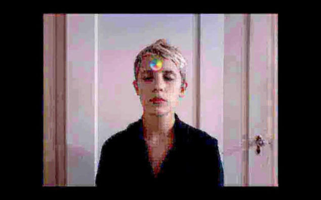
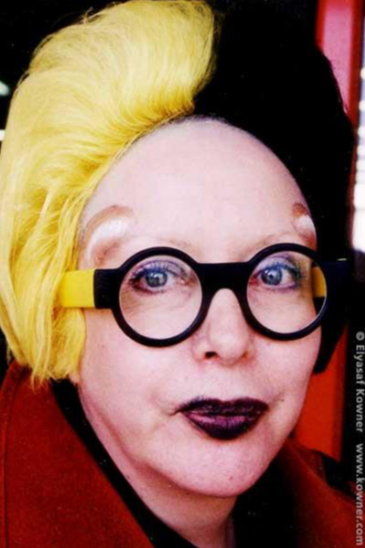

## Netochka Nezvanova and the Disembodied Woman

The first chapter of this thesis explored the dilemma female artists face when representing themselves online, due to the misogynist nature of cyberculture and the symbolic and literal perversion of the female body by the media and Internet users. In a cyberfeminist context, the assertion of a female identity and expression of that embodied experience is a rebellious act against the power structures of a male-dominated web. The representational strategies employed by these women rely on extant codes of femininity and an assertive new aesthetic of cyberfeminism, which rejects complicity with traditional performance and presentation of the female body.

A textual statement from VNS Matrix expresses the ways that subjectivity, signification, and desire are mutating on the Internet: “The pleasure’s in the dematerialization. The devolution of desire.”<a class="footnote">51VNS Matrix, bitch mutant manifesto (1996) http://www.obn.org/reading_room/manifestos/html/bitch.html</a> The pleasure afforded by dematerialization of the body can be seen in a video by Claire L. Evans entitled _Digital Decay: Meditation/Disintegration_. (Figure 1.7)<a class="footnote">52Claire L. Evans, _Digital Decay: Meditation/Disintegration_, 2011, via http://www.clairelevans.com/?cat=7#digital-decay-meditationdisintegration-2011 screen capture circa 2014</a> In the video, Evans is seated in front of a web camera with a spinning rainbow wheel positioned at her forehead. As she sits quietly, with her eyes closed, the animation consists of individual video frames saved in progressively lower quality formats hundreds of times being laid over each other, to the effect that the video quality is decaying into colorful visual static before our eyes. Evans asks the question “Where is the line at which compression ceases to preserve information entirely?” but the viewer, if unaware of the mechanical processes behind the video, is more concerned with the line at which Evans’ body disappears. When the pixels of her body and the background image are both corrupted to the point of random colors arranging themselves without differentiation, the viewer perceives no discontinuity between Evans and her surroundings. She has become assimilated into them by symbolically destroying them and herself through a process of oversaturation in which colors rendered in pixels too small for the eye to see are multiplied so many times that they lose their color entirely. This process recalls the remix aesthetic, and the work of art in the age of digital reproduction, but with the added element of mutation, an organic remix process borrowing a term from biological reproduction: “Mutation occurs when pattern can no longer be counted on to replicate itself, when pattern’s disruption by randomness becomes visibly evident in the body.”<a class="footnote">53Hayles, “The Condition of Virtuality”, 80</a> In this way, Evans represents the mutant cyborg and cyber-feminist subjectivity, but unlike Haraway and VNS Matrix, she is threatening the patriarchy through a very peaceful form of protest, the symbolic annihilation of her virtual body by its repetition.

## Figure 1.7, Claire L. Evans, _Digital Decay: Meditation/Disintegration_, 2011

While artists such as Jennifer Chan and Rachel de Joode have shown how difficult it is to incorporate their embodied experience in cyberspace, Netochka Nezvanova has avoided this problem by refusing to be embodied at all. She is perhaps the first and only entirely disembodied female net artist. Famed not only for her contributions to net art software, which include the development and distribution of live video editing programs used by electronic music producers, she was deemed “the most feared woman on the Internet” by Katharine Mieszkowski in 2002. In Mieszkowski’s article, she stresses the empowering effect of Nezvanova’s existence as an incorporeal entity, but a very real presence on the Internet. When her software has won awards, no single person has appeared to accept them. Her name, from the eponymous unfinished Dostoyevsky novel, translates in English to “nameless nobody,” but she has also been known to use multiple handles and email addresses on online mailing lists and forums, where her infamy stems from her inflammatory statements and aggressive, subversive aesthetic.<a class="footnote">54Katharine Mieskowski, “The most feared woman on the Internet” Salon, March 1, 2002 http://www.salon.com/2002/03/01/netochka/</a>

Netochka Nezvanova, also identified by the aliases “antiorp,” “integer,” “Irena Sabine Czubera,” and the cryptic “=cw4t7abs” was best known on mailing lists and public forums for her distinctive typing style, which incorporates several languages such as Croatian, French, Spanish, and a type of hacker slang called “leet,” or “l33t,” in which letters are replaced by numbers. She also communicated using ASCII art, forming pictures within text using keyboard symbols. A typical example of her cryptic messages, from September 2000:

>“modL c!t!zen t!.me 1999.ad”
“ou!. madame.”
“m!.handz=w!tr.dzn.urz !=ut!l!ze-uLtra.lux++”
“during the korporate fascist occupation. during the korporate fascist occupation. during the korporate fascist occupation.”
“and – closing the synaptic gap [synapse – greek for juncture – hence the juncture gap – protoplasmic kisses which seem to constitute the final ecstasy of an epic love story – the ethereal kiss which involves no contact]”
“enkouter!ng open zpasez”
“[sand and foam]”<a class="footnote">55olala on 27 Sep 2000, Nettime mailing list archives, http://www.nettime.org/Lists- Archives/nettime-bold-0009/msg00073.html</a>

It is curious that in all subsequent interviews with Netochka this typing style is absent, leading one to wonder exactly how many collaborators have constructed her identity over time. It is clear that the Netochka who contributed to the Nato.0+55+3d software, the Netochka who terrorized message boards, and the Netochka responding to interview questions are all different facets of a multidimensional character. Artists in Iceland, New Zealand, and Eastern Europe have been implicated, and her ISP addresses have been traced to Chicago, Australia, and Amsterdam.<a class="footnote">56olala on 27 Sep 2000, Nettime mailing list archives, http://www.nettime.org/Lists- Archives/nettime-bold-0009/msg00073.html</a> Several times she refers to herself as a “Balkan girl,” due in part, it seems, to both the affected European accent present in much of her writing, but also due to the fragmentary nature of the Balkan countries (to “balkanize,” as a verb, is now meant to divide into mutually hostile states or groups).

Netochka firmly denies any connection to the art collective NATOArts in her correspondence with Mieskowski, in which she responded publicly to correct several points in the article a month after its publication. She claims to be a singular person and a collective simultaneously, attacking many of Mieskowski’s assertions about her identity as false in a 60-point list quoting fragments of the article with her commentary (quotes have been italicized for clarity). Some of her most poetic and salient points regard her humanity, despite her lack of a stable physical identity:

>1. \\ Denying my humanity does not a verse make. Katharine Mieszkowski has written:
_‘For someone who does not exist -- at least the way you or I do’_
Prior to the illegal / criminal invasion of Poland in 1939,
NAZI propaganda films depicted Poles as less than human, as inhuman, as not
‘you or I’ or \`us\`.
German soldiers however, soon found that Poles much different than ‘you or I’ or \`us\` weren't.
They sweated, begot cavities, were prone to bouts of unhappiness and happiness,
when in the mood demanded attention and love, and ... they were very very stubborn.
http://www.geocities.com/Pentagon/9764/warpoland.html
My skin is filled with human blood. Not unlike yours.
>2. _She's a gifted computer programmer and polemicist, an artist_
I am \_not a computer programmer. polemicist nor artist [most artists have died]
I am a person and cyberbotanist.
...
>4. _a critic of capitalism and fascism, as well as a capitalist and a marketer._
I am not. I am. A person.
As a person, I have been known to criticize shortcuts to intelligence,
e.g. ‘employment’, ‘memory’, and the ‘education’ system.

Netochka not only takes issue with her portrayal by Mieszkowski, but with her sexist language. She returns many of her character defamations to the author deftly:

>47. _Netochka lives for attention._
When I am in the mood. Katharine Mieszkowski may relate.
>55. _Netochka refuses to be pinned down._
When I am in the mood. Katharine Mieszkowski may relate.

Although the hacker flavor of her typing style has almost disappeared entirely (note the lack of interspersed numbers and other languages), there is a wit and an honesty to her responses. Unwilling to reveal any further information, but willing to perpetuate the legend, this Netochka embraces the surreal and metaphysical qualities of her existence:

>50. _Ask Netochka a question about herself, and the answers appear illusory, like water running through your fingers._
Local delicacies include ostrige.
>51. _‘Is Netochka a figment of the Net's collective imagination?’ meets with this enigmatic reply: "A ty budesh chitat? There is only
01 of me.’_
It has been my destiny to join that great experience.
>60. _She's a capitalist who screams anti-capitalism, an artist who
infuriates artists, a Net phenomenon who terrorizes her medium._
She is a lovely person, not very happy ... but she is trying. She has come a l o n g way.
Now, she is approaching the greatest obstacle of her account. Wish her well +?
00 _She's a capitalist who screams anti-capitalism, an artist who infuriates artists, a Net phenomenon who terrorizes her medium._
And if I were to portray her as a cruel character assassin who slanders anyone
who disagrees with her publicly -- the great terror of the Net! -- so much the better.
Finished Katharine +? Good. You do not know NN for, likewise, I do not know.
_As she puts it, in e-mail: “Being ambiguous, we are deemed confused, rather than praised for the complexity of the order in our minds._”<a class="footnote">57integer on Monday, 4 Mar 2002 Nettime mailing list archives www.nettime.org http://amsterdam.nettime.org/Lists-Archives/nettime-bold-0203/msg00078.html</a>

It is precisely Netochka Nezvanova’s ambiguity and complexity that have sustained her legend in cyberspace, known for her artistically constructed identity as much as for her contributions to digital art. Nezvanova’s activity on the Internet appears to have ceased in the early 2000s, and it is hard to find records of her websites (such as m9ndfukc.com), especially given the multiple pseudonyms associated with the artist. Yet her legend lives on, due to how radically she altered the landscape of the spaces she inhabited. The construction of this identity as an online performance on a global scale is made possible by the fact that, as far as the online community knows, there is no body attached to the identity. Netochka is an incorporeal Internet entity, breaking the boundaries between countries and individuals. The performance of her existence is made possible by the interconnectedness of cyberspace, and its separation from the physical world. She is a ghost in the machine of the Internet.

An analogous analog artist would be the photographer Cindy Sherman. Throughout her career as a photographer, Sherman has depicted many different images of women, using herself as the model for a broad range of characters. Simultaneously playing the roles of photographer and model, she camouflages herself in the signifiers of femininity. Both the artist and model disappear, blending into the cultural milieu. Her early works in the _Film Stills_ series accomplished this by costuming her in a nostalgic haze of black and white. The identities she takes on in these scenes are constructed by their environment and the artifices of hair and makeup, continuous with their surrounding space in the context of a frozen scene, but utterly disconnected from reality, as the films and characters do not exist. The aesthetic choices Sherman makes to evoke the feeling of the 1950s in American film create a feminist critique of this era’s representations of women, and the normative standards of femininity established by such texts as Betty Friedan’s _The Feminine Mystique_. To quote Friedan, “the only commitment for women is the fulfillment of their own femininity.”<a class="footnote">58Leo Steinberg, _Other Criteria: Confrontations with Twentieth-Century Art_ (University of Chicago Press, 2007), 68</a> For both Sherman and Nezvanova, their femininity is the only element of the artist’s identity that remains consistent throughout these works (although Sherman will later go on to cross-dress as the old masters of fine art).

As Sherman removes the grounding elements of scene from her work, as in her _Untitled_ series of the 1980s, her characters appear in full color, graphically fragmenting and decomposing despite their artifice. Her body is increasingly tormented and fragmented by the same artifice that glues it together in the _Film Stills_, until she becomes a grotesque, obscene caricature of femininity.<a class="footnote">59Laura Mulvey, “A Phantasmagoria of the Female Body: The Work of Cindy Sherman” New Left Review (July – August 1991), 137-150</a> In much of her work, Sherman portrays the “fulfillment” of many women’s roles to the point of excess, calling attention to her own body as the medium through which the image is created. Amelia Jones has written both about Cindy Sherman and the artist Orlan, who has undergone multiple surgical procedures in order to reproduce and inscribe the characteristics of aestheticized femininity in her own flesh. Jones writes that Sherman’s art reveals “ourselves as embodied subjects through technologies of representation in relation to other embodied subjects.”<a class="footnote">60Robert A. Sobieszek _Ghost in the Shell: Photography and the Human Soul, 1850 – 2000_, (Los Angeles County Museum of Art + MIT Press, 1999), 255, footnote 128</a> In Sherman’s case, the technologies she employs are the framing and composition of her photographs, as well as the alterations made to her body by makeup and wardrobe, which she represents to the embodied subjects who visit her exhibitions. To analyze Nezvanova’s performance with the same framework, she employed the technologies of Internet message boards to create a disembodied subject in relation to other disembodied subjects online. Her textual performance serves the same function of constructing and obscuring her identity as all of Sherman’s photos’ manipulations of her body. Nezvanova has as much in common with Orlan as with Sherman, if not more, because they are both European woman artists who use their respective physical and disembodied identities as their artistic medium. In Jones’ words, “in her surgical performance pieces from 1990s onward, Orlan enacts Merleau-Ponty’s point, cited above, that there is no securable connection between the ‘interior’ of the self and bodily contour. Both Orlan’s practice and Merleau-Ponty’s philosophy point to the fallibility of our tendency to read the body as representational (as a ‘sign’ for the self).”<a class="footnote">61Amelia Jones, _Self/Image: Technology, Representation and the Contemporary Subject_, (Routledge, 2006), 32</a> By obliterating any identifying characteristics, through the media of photography, surgery, and text, all three artists sever the connection between their bodies and identities, or rather, affirm that they are disembodied women.

## Orlan’s “Girl Parts”: The Exquisite Corpse

A comparison between the surgeon and photographer, as I have made between Orlan and Sherman, has already been made by Walter Benjamin in his famous essay on the work of art in the age of mechanical reproduction. Contrasting a conflation of the surgeon/photographer with the magician/painter, he writes:

>The painter maintains in his work a natural distance from reality, the cameraman penetrates deeply into its web. There is a tremendous difference between the pictures they obtain. That of the painter is a total one, that of the cameraman consists of multiple fragments which are assembled under a new law.<a class="footnote">62Walter Benjamin, “The Work of Art in the Age of Mechanical Reproduction” (1935), 10, via http://design.wishiewashie.com/HT5/WalterBenjaminTheWorkofArt.pdf</a>

Orlan’s surgical work, in which she attempts to incorporate features from the bodies of other women, has also been compared to the work of the mad doctor in Mary Shelley’s _Frankenstein_.<a class="footnote">63Joanna Zylinska, _Cyborg Experiments: The Extensions of the Body in the Media Age_ (Continuum International Publishing, 2002), 39</a> This comparison, in part, may be due to the repulsion induced in the audience who witnesses her surgical mutilation, but Orlan explicitly wishes them not to suffer watching her. Her reconstruction of her own body through medical technology is less like the resurrection of a corpse than it is an exercise in creating a new body out of a more diverse subject material than corpse parts: the creation of an exquisite corpse. The _cadavre exquis_ was a collage technique pioneered by the Surrealists, which gained popularity as a parlor game of collective authorship. In modern versions of the game, a horizontally folded piece of paper is passed around a circle. The first person to draw begins a figure, and then folds the paper so that their contribution can’t be seen by the others, who must then continue the figure. The exquisite corpse was exercised as a collage technique by replacing the individual limbs of a figure with other pictures, household objects, animals, etc.<a class="footnote">64Elza Adamowicz, _Surrealist Collage in Text and Image: Dissecting the exquisite corpse_ (Cambridge University Press, 1998), 78</a> This technique is obviously much easier to produce by assemblages of paper than actual flesh, thus producing squeamishness in Orlan’s audiences. Some of the features Orlan has incorporated included prosthetics protruding from her skull, inserted under the skin of her forehead. These facial implants were originally modeled after the brow ridge of Leonardo da Vinci’s _Mona Lisa_, but look more like horns in the flesh (Figure 2.1)<a class="footnote">65Elyasaf Kowner, portrait of Orlan, 1998 via http://www.kowner.com/portraits/orlan.php</a>.

## Figure 2.1, Elyasaf Kowner, portrait of Orlan, 1998
