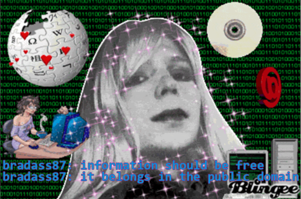
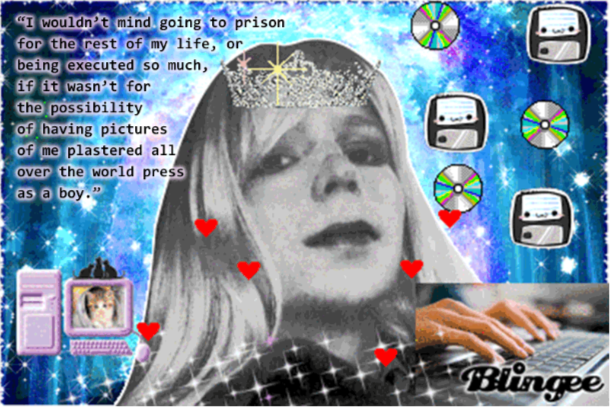

## Netochka Nezvanova and the Disembodied Woman

The first chapter of this thesis explored the dilemma female artists face when representing themselves online, due to the misogynist nature of cyberculture and the symbolic and literal perversion of the female body by the media and Internet users. In a cyberfeminist context, the assertion of a female identity and expression of that embodied experience is a rebellious act against the power structures of a male-dominated web. The representational strategies employed by these women rely on extant codes of femininity and an assertive new aesthetic of cyberfeminism, which rejects complicity with traditional performance and presentation of the female body.

A textual statement from VNS Matrix expresses the ways that subjectivity, signification, and desire are mutating on the Internet: “The pleasure’s in the dematerialization. The devolution of desire.”<a class="footnote">51VNS Matrix, bitch mutant manifesto (1996) http://www.obn.org/reading_room/manifestos/html/bitch.html</a> The pleasure afforded by dematerialization of the body can be seen in a video by Claire L. Evans entitled _Digital Decay: Meditation/Disintegration_. (Figure 1.7)<a class="footnote">52Claire L. Evans, _Digital Decay: Meditation/Disintegration_, 2011, via http://www.clairelevans.com/?cat=7#digital-decay-meditationdisintegration-2011 screen capture circa 2014</a> In the video, Evans is seated in front of a web camera with a spinning rainbow wheel positioned at her forehead. As she sits quietly, with her eyes closed, the animation consists of individual video frames saved in progressively lower quality formats hundreds of times being laid over each other, to the effect that the video quality is decaying into colorful visual static before our eyes. Evans asks the question “Where is the line at which compression ceases to preserve information entirely?” but the viewer, if unaware of the mechanical processes behind the video, is more concerned with the line at which Evans’ body disappears. When the pixels of her body and the background image are both corrupted to the point of random colors arranging themselves without differentiation, the viewer perceives no discontinuity between Evans and her surroundings. She has become assimilated into them by symbolically destroying them and herself through a process of oversaturation in which colors rendered in pixels too small for the eye to see are multiplied so many times that they lose their color entirely. This process recalls the remix aesthetic, and the work of art in the age of digital reproduction, but with the added element of mutation, an organic remix process borrowing a term from biological reproduction: “Mutation occurs when pattern can no longer be counted on to replicate itself, when pattern’s disruption by randomness becomes visibly evident in the body.”<a class="footnote">53Hayles, “The Condition of Virtuality”, 80</a> In this way, Evans represents the mutant cyborg and cyber-feminist subjectivity, but unlike Haraway and VNS Matrix, she is threatening the patriarchy through a very peaceful form of protest, the symbolic annihilation of her virtual body by its repetition.

### Figure 1.7, Claire L. Evans, _Digital Decay: Meditation/Disintegration_, 2011

While artists such as Jennifer Chan and Rachel de Joode have shown how difficult it is to incorporate their embodied experience in cyberspace, Netochka Nezvanova has avoided this problem by refusing to be embodied at all. She is perhaps the first and only entirely disembodied female net artist. Famed not only for her contributions to net art software, which include the development and distribution of live video editing programs used by electronic music producers, she was deemed “the most feared woman on the Internet” by Katharine Mieszkowski in 2002. In Mieszkowski’s article, she stresses the empowering effect of Nezvanova’s existence as an incorporeal entity, but a very real presence on the Internet. When her software has won awards, no single person has appeared to accept them. Her name, from the eponymous unfinished Dostoyevsky novel, translates in English to “nameless nobody,” but she has also been known to use multiple handles and email addresses on online mailing lists and forums, where her infamy stems from her inflammatory statements and aggressive, subversive aesthetic.<a class="footnote">54Katharine Mieskowski, “The most feared woman on the Internet” Salon, March 1, 2002 http://www.salon.com/2002/03/01/netochka/</a>

Netochka Nezvanova, also identified by the aliases “antiorp,” “integer,” “Irena Sabine Czubera,” and the cryptic “=cw4t7abs” was best known on mailing lists and public forums for her distinctive typing style, which incorporates several languages such as Croatian, French, Spanish, and a type of hacker slang called “leet,” or “l33t,” in which letters are replaced by numbers. She also communicated using ASCII art, forming pictures within text using keyboard symbols. A typical example of her cryptic messages, from September 2000:

<blockquote>
“modL c!t!zen t!.me 1999.ad”  
“ou!. madame.”  
“m!.handz=w!tr.dzn.urz !=ut!l!ze-uLtra.lux++”  
“during the korporate fascist occupation. during the korporate fascist occupation. during the korporate fascist occupation.”  
“and – closing the synaptic gap [synapse – greek for juncture – hence the juncture gap – protoplasmic kisses which seem to constitute the final ecstasy of an epic love story – the ethereal kiss which involves no contact]”  
“enkouter!ng open zpasez”  
“[sand and foam]”<a class="footnote">55olala on 27 Sep 2000, Nettime mailing list archives, http://www.nettime.org/Lists- Archives/nettime-bold-0009/msg00073.html</a>
</blockquote>

It is curious that in all subsequent interviews with Netochka this typing style is absent, leading one to wonder exactly how many collaborators have constructed her identity over time. It is clear that the Netochka who contributed to the Nato.0+55+3d software, the Netochka who terrorized message boards, and the Netochka responding to interview questions are all different facets of a multidimensional character. Artists in Iceland, New Zealand, and Eastern Europe have been implicated, and her ISP addresses have been traced to Chicago, Australia, and Amsterdam.<a class="footnote">56olala on 27 Sep 2000, Nettime mailing list archives, http://www.nettime.org/Lists- Archives/nettime-bold-0009/msg00073.html</a> Several times she refers to herself as a “Balkan girl,” due in part, it seems, to both the affected European accent present in much of her writing, but also due to the fragmentary nature of the Balkan countries (to “balkanize,” as a verb, is now meant to divide into mutually hostile states or groups).

Netochka firmly denies any connection to the art collective NATOArts in her correspondence with Mieskowski, in which she responded publicly to correct several points in the article a month after its publication. She claims to be a singular person and a collective simultaneously, attacking many of Mieskowski’s assertions about her identity as false in a 60-point list quoting fragments of the article with her commentary (quotes have been italicized for clarity). Some of her most poetic and salient points regard her humanity, despite her lack of a stable physical identity:

>1. \\ Denying my humanity does not a verse make.   Katharine Mieszkowski has written: 
_‘For someone who does not exist -- at least the way you or I do’_  
Prior to the illegal / criminal invasion of Poland in 1939, 
NAZI propaganda films depicted Poles as less than human, as inhuman, as not 
‘you or I’ or \`us\`.  
German soldiers however, soon found that Poles much different than ‘you or I’ or \`us\` weren't. 
They sweated, begot cavities, were prone to bouts of unhappiness and happiness, 
when in the mood demanded attention and love, and ... they were very very stubborn.  
http://www.geocities.com/Pentagon/9764/warpoland.html  
My skin is filled with human blood. 
Not unlike yours.  
>2. _She's a gifted computer programmer and polemicist, an artist_  
I am \_not a computer programmer. polemicist nor artist [most artists have died] 
I am a person and cyberbotanist.  
...  
>4. _a critic of capitalism and fascism, as well as a capitalist and a marketer._  
I am not. I am. A person.  
As a person, I have been known to criticize shortcuts to intelligence, 
e.g. ‘employment’, ‘memory’, and the ‘education’ system.

Netochka not only takes issue with her portrayal by Mieszkowski, but with her sexist language. She returns many of her character defamations to the author deftly:

>47. _Netochka lives for attention._  
When I am in the mood. Katharine Mieszkowski may relate.  
>55. _Netochka refuses to be pinned down._  
When I am in the mood. Katharine Mieszkowski may relate.

Although the hacker flavor of her typing style has almost disappeared entirely (note the lack of interspersed numbers and other languages), there is a wit and an honesty to her responses. Unwilling to reveal any further information, but willing to perpetuate the legend, this Netochka embraces the surreal and metaphysical qualities of her existence:

>50. _Ask Netochka a question about herself, and the answers appear illusory, like water running through your fingers._  
Local delicacies include ostrige.  
>51. _‘Is Netochka a figment of the Net's collective imagination?’ meets with this enigmatic reply: "A ty budesh chitat? There is only
01 of me.’_  
It has been my destiny to join that great experience.  
>60. _She's a capitalist who screams anti-capitalism, an artist who infuriates artists, a Net phenomenon who terrorizes her medium._  
She is a lovely person, not very happy ... but she is trying. She has come a l o n g way. 
Now, she is approaching the greatest obstacle of her account. Wish her well +?  
00 _She's a capitalist who screams anti-capitalism, an artist who infuriates artists, a Net phenomenon who terrorizes her medium._  
And if I were to portray her as a cruel character assassin who slanders anyone 
who disagrees with her publicly -- the great terror of the Net! -- so much the better.  
Finished Katharine +? 
Good. You do not know NN 
for, likewise, I do not know.  
_As she puts it, in e-mail: “Being ambiguous, we are deemed confused, rather than praised for the complexity of the order in our minds._”<a class="footnote">57integer on Monday, 4 Mar 2002 Nettime mailing list archives www.nettime.org http://amsterdam.nettime.org/Lists-Archives/nettime-bold-0203/msg00078.html</a>

It is precisely Netochka Nezvanova’s ambiguity and complexity that have sustained her legend in cyberspace, known for her artistically constructed identity as much as for her contributions to digital art. Nezvanova’s activity on the Internet appears to have ceased in the early 2000s, and it is hard to find records of her websites (such as m9ndfukc.com), especially given the multiple pseudonyms associated with the artist. Yet her legend lives on, due to how radically she altered the landscape of the spaces she inhabited. The construction of this identity as an online performance on a global scale is made possible by the fact that, as far as the online community knows, there is no body attached to the identity. Netochka is an incorporeal Internet entity, breaking the boundaries between countries and individuals. The performance of her existence is made possible by the interconnectedness of cyberspace, and its separation from the physical world. She is a ghost in the machine of the Internet.

An analogous analog artist would be the photographer Cindy Sherman. Throughout her career as a photographer, Sherman has depicted many different images of women, using herself as the model for a broad range of characters. Simultaneously playing the roles of photographer and model, she camouflages herself in the signifiers of femininity. Both the artist and model disappear, blending into the cultural milieu. Her early works in the _Film Stills_ series accomplished this by costuming her in a nostalgic haze of black and white. The identities she takes on in these scenes are constructed by their environment and the artifices of hair and makeup, continuous with their surrounding space in the context of a frozen scene, but utterly disconnected from reality, as the films and characters do not exist. The aesthetic choices Sherman makes to evoke the feeling of the 1950s in American film create a feminist critique of this era’s representations of women, and the normative standards of femininity established by such texts as Betty Friedan’s _The Feminine Mystique_. To quote Friedan, “the only commitment for women is the fulfillment of their own femininity.”<a class="footnote">58Leo Steinberg, _Other Criteria: Confrontations with Twentieth-Century Art_ (University of Chicago Press, 2007), 68</a> For both Sherman and Nezvanova, their femininity is the only element of the artist’s identity that remains consistent throughout these works (although Sherman will later go on to cross-dress as the old masters of fine art).

As Sherman removes the grounding elements of scene from her work, as in her _Untitled_ series of the 1980s, her characters appear in full color, graphically fragmenting and decomposing despite their artifice. Her body is increasingly tormented and fragmented by the same artifice that glues it together in the _Film Stills_, until she becomes a grotesque, obscene caricature of femininity.<a class="footnote">59Laura Mulvey, “A Phantasmagoria of the Female Body: The Work of Cindy Sherman” New Left Review (July – August 1991), 137-150</a> In much of her work, Sherman portrays the “fulfillment” of many women’s roles to the point of excess, calling attention to her own body as the medium through which the image is created. Amelia Jones has written both about Cindy Sherman and the artist Orlan, who has undergone multiple surgical procedures in order to reproduce and inscribe the characteristics of aestheticized femininity in her own flesh. Jones writes that Sherman’s art reveals “ourselves as embodied subjects through technologies of representation in relation to other embodied subjects.”<a class="footnote">60Robert A. Sobieszek _Ghost in the Shell: Photography and the Human Soul, 1850 – 2000_, (Los Angeles County Museum of Art + MIT Press, 1999), 255, footnote 128</a> In Sherman’s case, the technologies she employs are the framing and composition of her photographs, as well as the alterations made to her body by makeup and wardrobe, which she represents to the embodied subjects who visit her exhibitions. To analyze Nezvanova’s performance with the same framework, she employed the technologies of Internet message boards to create a disembodied subject in relation to other disembodied subjects online. Her textual performance serves the same function of constructing and obscuring her identity as all of Sherman’s photos’ manipulations of her body. Nezvanova has as much in common with Orlan as with Sherman, if not more, because they are both European woman artists who use their respective physical and disembodied identities as their artistic medium. In Jones’ words, “in her surgical performance pieces from 1990s onward, Orlan enacts Merleau-Ponty’s point, cited above, that there is no securable connection between the ‘interior’ of the self and bodily contour. Both Orlan’s practice and Merleau-Ponty’s philosophy point to the fallibility of our tendency to read the body as representational (as a ‘sign’ for the self).”<a class="footnote">61Amelia Jones, _Self/Image: Technology, Representation and the Contemporary Subject_, (Routledge, 2006), 32</a> By obliterating any identifying characteristics, through the media of photography, surgery, and text, all three artists sever the connection between their bodies and identities, or rather, affirm that they are disembodied women.

## Orlan’s “Girl Parts”: The Exquisite Corpse

A comparison between the surgeon and photographer, as I have made between Orlan and Sherman, has already been made by Walter Benjamin in his famous essay on the work of art in the age of mechanical reproduction. Contrasting a conflation of the surgeon/photographer with the magician/painter, he writes:

>The painter maintains in his work a natural distance from reality, the cameraman penetrates deeply into its web. There is a tremendous difference between the pictures they obtain. That of the painter is a total one, that of the cameraman consists of multiple fragments which are assembled under a new law.<a class="footnote">62Walter Benjamin, “The Work of Art in the Age of Mechanical Reproduction” (1935), 10, via http://design.wishiewashie.com/HT5/WalterBenjaminTheWorkofArt.pdf</a>

Orlan’s surgical work, in which she attempts to incorporate features from the bodies of other women, has also been compared to the work of the mad doctor in Mary Shelley’s _Frankenstein_.<a class="footnote">63Joanna Zylinska, _Cyborg Experiments: The Extensions of the Body in the Media Age_ (Continuum International Publishing, 2002), 39</a> This comparison, in part, may be due to the repulsion induced in the audience who witnesses her surgical mutilation, but Orlan explicitly wishes them not to suffer watching her. Her reconstruction of her own body through medical technology is less like the resurrection of a corpse than it is an exercise in creating a new body out of a more diverse subject material than corpse parts: the creation of an exquisite corpse. The _cadavre exquis_ was a collage technique pioneered by the Surrealists, which gained popularity as a parlor game of collective authorship. In modern versions of the game, a horizontally folded piece of paper is passed around a circle. The first person to draw begins a figure, and then folds the paper so that their contribution can’t be seen by the others, who must then continue the figure. The exquisite corpse was exercised as a collage technique by replacing the individual limbs of a figure with other pictures, household objects, animals, etc.<a class="footnote">64Elza Adamowicz, _Surrealist Collage in Text and Image: Dissecting the exquisite corpse_ (Cambridge University Press, 1998), 78</a> This technique is obviously much easier to produce by assemblages of paper than actual flesh, thus producing squeamishness in Orlan’s audiences. Some of the features Orlan has incorporated included prosthetics protruding from her skull, inserted under the skin of her forehead. These facial implants were originally modeled after the brow ridge of Leonardo da Vinci’s _Mona Lisa_, but look more like horns in the flesh (Figure 2.1)<a class="footnote">65Elyasaf Kowner, portrait of Orlan, 1998 via http://www.kowner.com/portraits/orlan.php</a>.

### Figure 2.1, Elyasaf Kowner, portrait of Orlan, 1998

The chimerical nature of bodies created using exquisite corpse techniques causes them to be seen as monstrous, but both Orlan and the Surrealists draw from the iconography of art history. In the case of the Surrealists, they often remixed images of the classical female body such as the _Mona Lisa_, and the statue of Venus de Milo. Both the Surrealists and Orlan construct a modern body by dissecting classical forms and reassembling them with cyborg parts. In Orlan’s case, she does this not only by surgically altering her body but also through her photograph series of _Self-Hybridization_. In the first series, from 1994, she overlays pictures of goddesses like Botticelli’s Venus with pictures of her own face, using a lightbox and photographs. The varying degrees of transparency she employs allow either her face or the goddesses’ to predominate, with a subtle blending of their features in many of the photos, hence the subtitle: “In-Between.”<a class="footnote">66Orlan, “Self-Hybridization, In-Between”, 1994 via http://www.orlan.eu/works/</a> As an example of mediation between cyborgs and goddesses, this representational strategy works because the classical image partially obscures the skin of the face, which has been severely compromised multiple times by surgery. It is only through the lens of history that the audience can ignore the Frankensteinian connotations that accompany the assemblage of others’ body parts.

The Surrealists’ tradition of the exquisite corpse is very much alive in net art projects, such as the virtual gallery at cloaque.org. Created and curated by the artists Claudia Mate and Carlos Saez, it is a vertical scrolling collage without borders, which many artists have contributed to. It is self-described as a “digital landfill... the result of the collection, treatment and joining together of a series of images found online, to create a column of digital compost.”<a class="footnote">67“about” www.cloaque.org</a> Most of the images present in the collages were found as readymades by net artists and digitally manipulated, but there is a disclaimer included on the website: “If any images of you or any images that you own are included in the composition, and you are not happy with this, please contact us regarding their immediate removal.”<a class="footnote">68“about” www.cloaque.org</a> Unlike the “found objects” of chapter one, innocent self-portraits being appropriated by fetish sites, the detritus of the web that ends up in this “digital landfill” is often more abstracted material like texture samples, patterns, and geometric animations using the most up-to-date graphics materials as well as the eight-bit treasures of the past.

The name and description refer to the anatomical cloaca, which serves an excretory function for the intestinal, reproductive, or urinary tracts of many species.<a class="footnote">69Britannica Academic Edition, “cloaca” Encyclopedia Britannica Inc, 2014 via http://www.britannica.com/EBchecked/topic/121929/cloaca</a> Artists are increasingly exploring the use of bodily structures to describe the structure of cyber spaces as a navigational option, situating the body not only in space but referring to the structure of cyberspace as a body being inhabited. Artist Faith Holland’s contribution to the cloaque.org collage is titled _Cyberpussy Pearl Necklace_. It is set apart from the other compositions by a bright pink text that says, “Cyberspace has a Shape, an overall total form. The Shape matters totally. The apprehension of the Shape is the grail.” The text is surrounded by circles containing animations that give the viewer the sense of speeding through outer space as lights spin by, leaving trails, or exploding into each other. Expansion, combustion, and exploration are evoked, not only in relation to space travel, but also inside of cities and inside their citizens. These are Faith’s “cyber pussies” which can also be found on an external website called vvvvvv.xxx (presumably read as www.xxx).

## The Matrix

As the creators of cloaque.org construct their virtual space as an anal cavity, Faith Holland imagines it is a vagina, not only the birth canal, but also the womb. Like cyberfeminist group VNS Matrix, she points out the Latin root of the word “matrix,” a word often used to describe the structure of cyberspace, from _mater_ (“mother”).<a class="footnote">70Faith Holland, “Links,” 2013 vvvvvv.xxx/links</a> Before the site can be viewed, there is an age verification page similar to that of hardcore porn sites, with the sound of a dial-up connection embedded in the background. The six v’s of the site name are resolved into a “WWW*” logo, for the world wide web, and pink text warns:

>The material on this site is sexually oriented and/or explicit and is related to material of a sexual nature. This material could be considered offensive and/or inappropriate for minors, engineers, programmers, technological governmental offices, science fiction fans, internet service providers, data centers, the Motion Pictures Association of America, United States Copyright Office, net artists, self-hating women, and individuals who self-identify as men.<a class="footnote">71VVVVVV.xxx</a>

Before one even enters Holland’s site, she cheekily makes her cyberfeminist agenda clear: this is a female-dominated space, not necessarily safe for men. The background of the sites consists of a bright green and black grid pattern stretching infinitely out of the darkness, an obvious reference to “The Matrix” film of 1999. The .xxx address, a type of web domain which only became available for porn sites to purchase in early 2011, connotes explicit content to be found inside, and by additionally making the viewer confirm they are older than 18, Holland makes an explicit reference to pornography. The pornographic body, which is often both as surgically altered as Orlan’s, and as culturally mandated as Sherman’s, is ubiquitous online but completely absent in Holland’s parodic pornographic “Matrix.”

The first pop-up window that appears prints the words “Surfing the gap pit gulf lack void hole dent chasm abyss socket dearth cavity absence deficit omission interstice depression inadequacy inferiority insufficiency of language.” The front page of the website consists only of a pink navigation bar, the same green-black matrix background, and an embedded video. Within the video, a young boy has an electronic device strapped to his skull by an older woman with red hair. The video has the look of an early 80s movie, with the colors slightly distorted towards red and a frosty filter glazing the scene. He yells “What the fuck!” as a pneumatic sound attaches to the device his head and she reassures him, crooning, “Shh, it’s okay. It is harmless... You are the navigator... The chair is powered by your body, the journey is fueled by your imagination. It needs you and your mind to work, and perhaps you need it too. Mutual stimulation... Clear your mind, let go.” She waves her hand in front of his face like an enchantress and he closes his eyes as a blue light pulses over his face. Soon frames of Holland’s “cyber pussy” animations are interspersed with the same pneumatic sound, faster and faster until the boy is overtaken by the blue glow and the words “COMING SOON” and “Faith Holland 2012” appear. In the video, the artist can be seen as represented by the mysterious older woman, introducing a generation of young men to her new formulation of cyberspace. By framing this interaction as a scene from a movie of a specific era, Holland employs the same techniques as Sherman, but in this case it is to comment on the future, not the past. Using another woman’s character from an earlier era of film, Holland is disembodied and embedded in the space she creates, which is being transmitted to the boy directly into his skull via the technological apparatus. A parallel can be drawn between Holland’s seductive surrogate and the way young men are brainwashed by pornography, but with a cyberfeminist twist, further emphasized by a sidebar of parodic banner ads for “Pussy Juice,” “powerful & quick clitoral enhancement,” pink pills for longer-lasting orgasms, and a black banner with flashing text that reads “Click here to chat LIVE with HOT PUSSIES”.

The “hot pussies” are located in the Private Viewing Rooms, where a seductive female voice greets and directs the viewer: “Click on a still cyberpussy to see her come to life in a private viewing room.” Selecting the first animation, a green-walled “Birth Canal,” leads to another page where the animation is isolated. There are no further instructions, but moving the cursor around the page, it is clear when it turns into a hand that there is another link embedded in the animation. Clicking again leads to a full screen image, an immersive experience through the animation, which loops indefinitely. Clicking again leads to the next private viewing room. In this way, the cyber pussies act as hyperlinks, appearing and functioning as wormholes in cyberspace. The privacy of the viewing rooms is obliterated by their public availability and interconnectedness, and serves as a metaphor for all activity on the Internet. One of the pop-ups in the private viewing rooms presents a list of percentages entitled “%%% XX”:

>Nudes in Met Museum 83% 
Porn Performers 70% 
Web Developers 38% 
NYC Gallery Solo Shows 23% 
Software Developers 20% 
Artists in MoMA 8%<a class="footnote">72“%%% XX” http://vvvvvv.xxx/vvvvvvpa/percents.html</a>

These data suggest that women (signified by their XX chromosomes) are overrepresented in nude paintings and the porn industry, but underrepresented in both the technological industries and art world.

Clicking on the “About” link leads to another page of embedded video, in which pink text is printed, rearranged, flown in and out of view, bolded and resized for punctuation and emphasis. The final product of these text fragments is Holland’s _Cyberpussy Manifesto_:

>The Internet is made of pussies.  
These pussies are porn. They constitute the most popular web content.  
These pussies are cats. Their images and videos are the second most popular web content.  
These pussies are users. Women.  
These pussies are creators. Beginning with Ada Lovelace and continuing into the future.  
These pussies are the structure and foundation of the Internet.  
Pry open the orifice of the internet with a speculum and you will find the tunneling halls of a vagina.  
These tubes connect in an orgiastic flow of information.  
Link to link, the internet is always touching herself.  
It is with pleasure that one site rubs another.  
The internet is not a masculine domain. Art is not a masculine domain.  
Scopophilia is not a masculine domain.  
Language is not a masculine domain.  
When we surf the webbed sea of pussies, we refuse to fall into the void of language.  
These pussies are not commodities. They speak in a polyvocal folkloric language.  
Technology is a reconstructed biology.  
Biology is a sociotechnological structure.  
Let cyberspace and meatspace join to form a post-millennial re- embodiment.  
The Symbolic is broken. The Imaginary is broken. Re-examine the Real through the Virtual.  
Cyberpussy Manifesto  
Faith Holland  
2013

Considering the cyberfeminist manifestos covered in the first chapter, Holland is clearly not the first to characterize the Internet as a whole as feminine. She is, however, making quite a new statement to say that the network of information is an interconnected web of vaginas. Her likening of the tubular structure to female anatomy recalls a statement by U.S. Senator Ted Stevens in 2006, when he voted against a telecommunications bill, and described the Internet as a “series of tubes.” His description went viral on the Internet, producing a meme known as “Series of Tubes.”<a class="footnote">73KnowYourMeme.com, “Series of Tubes,” http://knowyourmeme.com/memes/series- of-tubes</a> Stevens was not entirely wrong in his description, but to revisit his statement with Holland’s structure in mind gives it an entirely inappropriate hilarity:

>They want to deliver vast amounts of information over the Internet. And again, the Internet is not something that you just dump something on. It’s not a big truck. It’s a series of tubes. And if you don’t understand, those tubes can be filled and if they are filled, when you put your message in, it gets in line and it’s going to be delayed by anyone that puts into that tube enormous amounts of material.<a class="footnote">74Wired blogs, “Your Own Personal Internet,” June 2006 http://www.wired.com/threatlevel/2006/06/your_own_person/</a>

In the same statement, Stevens went on to mention: “Now we have a separate Department of Defense internet now, did you know that? Do you know why? Because they have to have theirs delivered immediately. They can’t afford getting delayed by other people.”<a class="footnote">75Wired blogs, “Your Own Personal Internet,” June 2006 http://www.wired.com/threatlevel/2006/06/your_own_person/</a> Recalling the fact that the United States Defense Department started the Internet, it is clear that in the thirty years since its initial development, the public distribution of Internet technology has altered the landscape so much that it can no longer be controlled, and the government must re-privatize its own Internet. Because of the fact that the Internet has become increasingly public, one of its highest virtues is that of privacy: for the public, it is the protection of data from corporations and hackers, and for the establishment, anti-piracy and net neutrality laws being considered by the government to control the flow of information through the tubes. For her part, Faith Holland has addressed these political issues with her “Chelsea Manning Fan Art” on her personal website www.faithholland.com.

Chelsea, formerly known as Pvt. Bradley Manning, was the soldier who released thousands of government documents, including material on the Iraq war and US diplomatic cables, to WikiLeaks. Because of this, Manning is serving a 35-year prison sentence, and is considered a hero to those who think all information should be free on the Internet. On August 22, 2013, Manning came out as transgender, and has chosen to live the rest of her life as Chelsea Manning.<a class="footnote">76About Pvt. Manning, Pvt. Manning Support Network, via http://www.privatemanning.org/learn-more/bradley-manning</a> Holland’s fan art emphasizes her enthusiasm not only for Manning’s political acts, but her choice of embodiment. Pictures of Manning in a blonde wig have been colorized by Holland and decorated with gifs and clip art, in the style of teenage girls decorating pictures of their favorite celebrities. Two of her pictures, created using Blingee animations, also contain statements supposedly by Manning. The first (Figure 2.2)<a class="footnote">77Faith Holland, _Chelsea Manning Fan Art 2_, 2013, via http://www.faithholland.com/chelsea-manning/chelsea-manning-fan-art-2 screen capture circa 2014</a> contains text that looks like an online chat from “bradass87”: “information should be free”, “bradass87: it belongs in the public domain.” This collage emphasizes the status of Manning as a hacker, using a background reminiscent of the Matrix, with flashing green 1s and 0s tiling the page, despite the fact that Manning’s leaks were not technically acquired through computer hacking (she removed the information on a flash drive). Holland has surrounded Manning’s face at the center with pink glitter, a spinning disc and “@” symbol, a Wikipedia logo covered in hearts, and a picture of a woman drinking coffee in front of a computer, which all emphasize her femininity with the girl power aesthetic. The second collage of this type (Figure 2.3)<a class="footnote">79Faith Holland, _Chelsea Manning Fan Art 8_, 2013, via http://www.faithholland.com/chelsea-manning/chelsea-manning-fan-art-8 screen capture circa 2014</a> contains the text “I wouldn’t mind going to prison for the rest of my life, or being executed so much, if it wasn’t for the possibility of having pictures of me plastered all over the world press as a boy.” In this picture, Holland’s face is in front of a shiny and sparkly background, with a tiara and hearts floating around her head. Floppy discs and CDs float in the air opposite the “quote” (which may or may not be an actual statement from Manning) and next to her face is a computer showing pictures of cats. These collage-type pictures clearly show a valorization of Manning as a girl hero of the Internet, using the language of Internet fandom and the symbolic repertoire most readily available to teenage girls.

### Figure 2.2, Faith Holland, _Chelsea Manning Fan Art 2_, 2013

### Figure 2.3, Faith Holland, _Chelsea Manning Fan Art 8_, 2013

Other images in the Fan Art series make more of Manning’s transition, including one in which the same picture of her head is placed atop a flashing male or female body made of ASCII art, posed in classical style. Through her Fan Art images, Holland helps to disembody the image of Manning portrayed by the media (as Bradley) and to celebrate Chelsea’s reclamation of her body as female. Manning embodies last statements of Holland’s _Cyberpussy Manifesto_: “Technology is a reconstructed biology. Biology is a sociotechnological structure. Let cyberspace and meatspace join to form a post-millennial re-embodiment.” Like Orlan and Sherman, Manning has chosen to present the culturally mandated form of femininity, reclaiming the female body as a representation of freedom and autonomy. Manning shares the project of cyberfeminists to liberate women from conventional entanglement in hegemonic power structures. Her detractors make the same arguments about Manning’s choice of embodiment as they do against women who choose to participate in military or technological industries, that it is “unnatural.” But as we know from studying Haraway’s cyborg, very little about postmodern life is left to nature, and all cyborgs are post-gender through usage of technology.

Emphasizing the fact that Manning is a hacker hero, she could be compared to the protagonist of “The Matrix” film, Neo. In the sense that he is stubbornly attached to his embodiment, Neo is far from as liberated as Manning, but they have in common their drive to motivate the populace through disseminated information. In the alternate future universe of the film, machines gained sentience and went to war with mankind. During their struggle, humans blacked out the sky to try to keep the machines from using solar power, but the machines still won the war. This led to the enslavement of mankind as an energy source for the machines and the creation of the Matrix. All humans (except for those rebels living in the subterranean city of Zion) are now grown in vast fields, like factory farmed crops, and kept in womblike sacs. They are physically plugged into the Matrix at birth, by a cord attached to the back of the neck, and spend their lives believing they live in the virtual reality provided to them by the machines, while the machines use them as batteries for their civilization. The Matrix is a simulation of reality in the twenty- first century, represented visually as a computer code, a cascading stream of green numbers, which renders all facets of life, including the bodies of those inside of it. This motif of cascading green numbers is commonly used to signify the Internet and the aesthetic of simulation.

While still inside of the Matrix, Neo meets Morpheus, who is aware of the illusion they live in. In a now-famous monologue, Morpheus says he imagines that Neo must be feeling “like Alice, tumbling down the rabbit hole,” a female protagonist trying to grapple with a space whose borders are unknown to her. In this scene he explains the nature of the Matrix:

>The Matrix is everywhere, it is all around us. Even now, in this very room. You can see it when you look out your window, or when you turn on your television. You can feel it when you go to work, when you go to church, when you pay your taxes. It is the wool that has been pulled over your eyes to blind you from the truth... That you are a slave, Neo. Like everyone else, you were born into bondage, born into a prison that you cannot smell or taste or touch. A prison for your mind. Unfortunately, no one can be told what the Matrix is, you have to see it for yourself... You take the blue pill, the story ends, you wake up in your bed and believe whatever you want. You take the red pill, you stay in Wonderland, and I show you how deep the rabbit hole goes.

After Neo takes the red pill, he is plugged into a series of machines and one of Morpheus’ crewmembers warns him: “Buckle your seatbelt, Dorothy, because Kansas is going bye- bye,” another reference to a female protagonist navigating an unknown space.

When he looks to the mirror, he finds its fragmented surface moving, resealing the cracks that break up his reflection. He reaches out to touch it, and his hand dips into the surface as though it were a viscous liquid, which sticks to his hand and begins to flow over the surface of his whole body. As it flows into his mouth and forces its way down his throat, his scream is digitized and the image of his real body, in the pod/womb it was grown in by the machines, replaces the image of his simulated body in the Matrix. He is naked, hairless, and has wires plugged into various parts of his torso. Like a baby bird breaking the membrane inside of a shell, he stretches his limbs out to escape the fluid he is encased in. He removes the tubes from his nose and mouth, which were artificially supporting him, and struggles for air. He feels the largest plug, the one connecting him to the Matrix, at the back of his skull, and turns to see rows of interconnected pods, containing other humans. In this scene, the connection between the Matrix of cyberpunk fantasy and the womb is very explicitly stated. When an arachnid-looking robot comes to inspect the breach of his pod, he is completely disconnected from his various umbilical protrusions and flushed down a water slide resembling a sewage tube, less a metaphor for birth than for excretion.

Once he is extracted by Morpheus and the crew of his ship, they rehabilitate his fetal body, his eyes having never been used for sight and his muscles having never achieved locomotion. When he is plugged back into the Matrix, they are able to upload data to his brain such as knowledge of fighting techniques, which he can then employ in his simulated body. Once the “mind over matter” nature of his existence in the Matrix is established, he has superhuman abilities, able to fly and stop bullets. His conception of himself is the only thing that keeps his bodily appearance stable in the various simulations. He goes through costume changes, such as wearing the uniform of a martial arts master, and adopting a black leather trench coat and sunglasses, but his physical embodiment in the Matrix never changes. Perhaps this is due to the stability of Neo’s identity, as a cis-gendered white male, despite his acquisition of the freedom to alter his appearance however he wishes. Reimagining the possibilities, however, it would make just as much sense for another actor, or even an actress, to portray Neo in the simulation. The references to Alice in Wonderland and Dorothy of Oz would perhaps take on more significance if Neo were to change sex. Recalling how humans in this society are born cyborgs, and may never fully identify with their “real” bodies, Neo’s character could easily be transgendered within the simulation, or have an entirely different body than the one he imagines in the Matrix.

The ability for someone within the Matrix to switch bodies, changing their gender or their identity, is proved possible twice. The first example is the woman in the red dress. As Morpheus and Neo walk down a street in a simulation of the simulation of the Matrix, a beautiful blonde woman in a red dress passes them by. Morpheus has just been telling Neo how no one in the simulation can be trusted, the civilians aren’t ready to be unplugged, and Neo turns his head to watch a living pin-up girl pass them on the street. Morpheus asks, “Are you listening to me, Neo? Or were you looking at the woman in the red dress?” He says, “Look again,” and a man in a suit has replaced the woman in the red dress, pointing a gun at Neo’s face. He is an agent, a sentient computer program who takes an embodied form in the Matrix to keep the population under control. The corporate aesthetic adopted in the film for the embodiment of these particular characters, and his guise as a sexy, beautiful woman, speaks again to the corporatization of the net and the seduction techniques used to control netizens through advertising and pornography. The woman in the red dress is one of the few recurring female characters in film, besides Trinity, Neo’s love interest. In the interest of queering Neo’s character, I have mostly excluded her from my analyses, but needless to say the representation of women outside of the context of a love interest or trap, and often both, is lacking.

The second example is that of the Oracle. She is the embodiment of the goddess, an extra-human life form who also lives in the Matrix, but unlike the Architect, who embodies a godlike figure, she is benevolent towards humanity and tries to help Neo on his quest. In the first movie, she is played by Gloria Foster, an actress of stage and screen from Chicago, Illinois. She co-starred in a stage production of “Having Our Say” in 1995 with the actress Mary Alice, who replaces her in the 2003 sequel “The Matrix: Revolutions.”<a class="footnote">80IMDb, Gloria Foster – Biography, http://www.imdb.com/name/nm0287825/bio?ref_=nm_ov_bio_sm</a> When Neo tries to visit the Oracle again in the sequel, she asks him if he can recognize her, and explains vaguely, “Some bets you lose, some bets you keep. I don’t yet recognize my face in the mirror, but... I still love candy.” She offers him a hard sweet in the same grandmotherly way as she did in the first movie. Although it was probably not intended by the writers of the first Matrix movie, because of Gloria Foster’s death from diabetes in 2001, the Oracle chooses her embodiment. She understands that if there is going to be a radical change in the world, she must also be subject to change, even in her physical form, unlike Neo. Whether she is being played by Foster or Alice, her ability to be dis-embodied and re-embodied, and retain her memories (a complication of reincarnation which will be discussed in chapter 3) is an ability exercised only by the goddess, and not by Neo, who, despite his godlike powers, never relinquishes his embodied form.

The Matrix network, in the dystopian reality of the movie, is one of oppression and Freudian horror, as the people are stymied by their attachment to the mother machine. As in the preprogrammed flow of code in the Matrix, cyborg bodies are continuous with the space around them, made of the same fabric of data and found parts. Unlike the enslaved residents of the Matrix, however, we have a choice of embodiment. Faith Holland’s re-imagining of the matrix of cyberspace as a network of women’s bodies plays on the desire for penetration and control of cyberspace by governmental and corporate entities, similar to the fears of humanity’s enslavement by technology. Establishing a pornographic space by buying a .xxx address, in which there are no bodies, her Cyberpussy Matrix rejects the idea of the body in cyberspace. Her pornographic performers are disembodied sensations of motion in unbounded space and time. When the borders are removed from the body/space, having moved away from representations of bodies having a 1-to-1 correlation to identities (as in the selfie), the body and identity are free to mutate in many ways. The first option, presented by Claire L. Evans and Netochka Nezvanova, is an alternative dis-embodiment created by fragments of a presence. To carefully reconstruct an identity using fragmented representations, whether, like Sherman, we change the superficial cultural signifiers adorning the physical body, or like Orlan and Chelsea Manning, we go deeper, severing the connection of the flesh from the identity, cyberspace allows representations of embodiment to defy the limitations imposed by the social construction and performance of gender.
