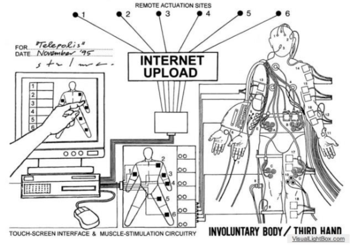
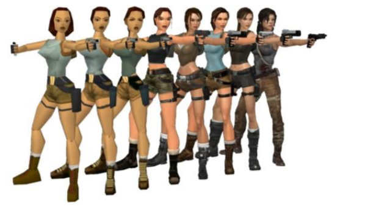
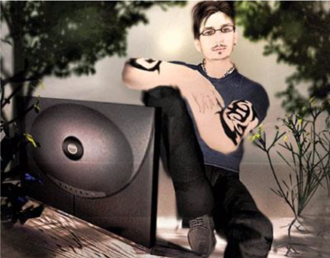
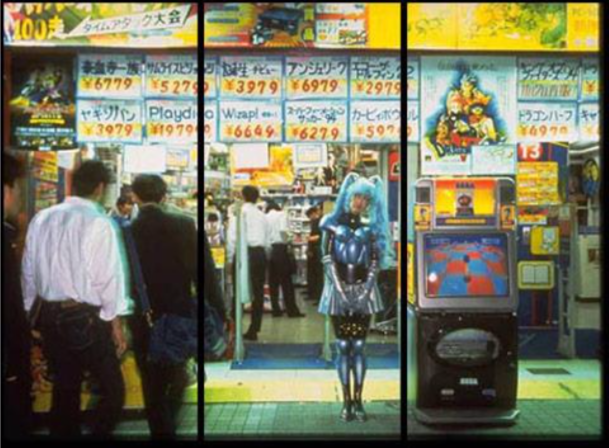

## Cyborgs in Space

The word “cyborg” originates from a novel combination of the words “cybernetic” and “organism” by the scientist, inventor, and musician Manfred Clynes in the year 1960. Although most of its contemporary representational power comes from fusions of men and machines in science fiction, it was coined to describe a very real predicament: the artificial life-support systems necessary to support human space travel.<a class="footnote" onclick="showCitation(this)">80Chris Hables Gray, _Cyborg Citizen: Politics in the Posthuman Age_, (New York: Routledge, 2001), 18</a> The human being, equipped to float in space, is umbilically tethered to the mother ship, and completely encased in a virtual reality simulation of Earth’s atmosphere complete with pressure, breathable air, water, heat insulation, and communications, among other necessities. It is not surprising that pioneers of cyberspace have also found this term useful for navigating embodied experience online, in Earth-bound virtual realities:

>Five or six hours of being cyborged on-line had incredible effects on my body. When I walked outside into the rain, I felt lighter, not all there. And it was not because my consciousness was still back in that virtual elsewhere in cyberspace where it had just been bumping clumsily (textually) into the other attendees’ projections. While talking at once to the simulations from Australia, England, Germany, Puerto Rico, New York, Boston, Seattle, and San Francisco, it became impossible to think of the world as anything other than hanging in space showing one face after another to the sun. Morning
in Australia was afternoon in Oregon and late evening in London.<a class="footnote" onclick="showCitation(this)">81Chris Hables Gray, _Cyborg Citizen: Politics in the Posthuman Age_, (New York: Routledge, 2001), 132</a>

Luckily the physical necessities to simulate the perspective of the cyborg in cyberspace are not as difficult to provide for than space proper, and although it is not currently technologically feasible to smell or taste through computers, the aesthetic of simulation provides more than adequately for the visual and aural senses. The conveyance of touch has been simulated by technologies that transform the body into the cyborg by outfitting it with extra sensors to send and receive data, as in some of Stelarc’s cyborg projects (Figure 3.1)<a class="footnote" onclick="showCitation(this)">82Stelarc, _Fractal Flesh_, via http://stelarc.org/?catID=20290 screen capture circa 2014</a>. But it has also metaphorically extended the reach of netizens around the globe to rub elbows, virtually, with each other.

### Figure 3.1, Stelarc, _Fractal Flesh_

Sitting in front of a computer, the user has a similar awareness vis-à-vis the machine, as they do in relation to a painting: the window, although flat, is also immersive. Figural techniques, such as classic Renaissance perspective, position the viewer very specifically in relation to the scene. Art historian and media theoretician Oliver Grau makes the comparison with virtual reality, asserting that:

>the idea of installing an observer in a hermetically closed-off image space of illusion did not make its first appearance with the technical invention of computer-aided virtual realities. On the contrary, virtual reality forms part of the core of the relationship of humans to images. It is grounded in art traditions, which have received scant attention up to now, that, in the course of history, suffered ruptures and discontinuities, were subject to the specific media of their epoch, and used to transport content of a highly disparate nature. Yet the idea goes back at least as far as the classical world, and it now reappears in the immersion strategies of present-day virtual art.<a class="footnote" onclick="showCitation(this)">83Bernadette Weigenstein, _Getting Under The Skin: Body and Media Theory_, (Cambridge: MIT Press, 2006), 70</a>

The immersive quality of a perspectival painting is generated by altering the viewer’s perception of their relationship to the painted space. Within the spaces established in the painting, they feel as though their body is situated at a certain point, as though the space depicted were to extend beyond the boundaries of the canvas and envelop them. This sense of the projection of the body into figural spaces, and extension of figural space to create a virtual reality, is echoed by David Joselit:

>These are the symptoms of a new spatial order: a space in which the virtual and the physical are absolutely coextensive, allowing a person to travel in one direction through sound or image while proceeding elsewhere physically. Imaginative projection is as old as the histories of art, theater, and literature -- in other words, as old as humanity itself -- but virtuality suggests the sensation of inhabiting such projections bodily... The experience of straddling two or more locations simultaneously has caused the negotiation of both physical and virtual worlds to become increasingly disembodied, and, as with any cultural shift, this transformation has produced new opportunities for art.<a class="footnote" onclick="showCitation(this)">84David Joselit, “Navigating the New Territory: Art, Avatars, and the Contemporary Mediascape,” in _Artforum International_ 43 (Summer, 2005)</a>

While Joselit argues that the sensation of being both within a virtual space and physically situated elsewhere is to be “disembodied,” these simultaneous embodiment phenomena do not cancel each other out to produce a disembodied state, but a sense of multiple presence. Scholarship on cyberspace has sought to reconcile these technologically mediated extrasensory phenomena using the terms, “post-human” or “trans-human.” The post-human is “neither male nor female, neither human nor machine, neither dead nor alive. Indeed, mutation is central to the notion of the post-human, describing a human identity which is caught between the idea that the self is becoming ‘other’ than itself, and the image of that self which is being mediated by the very technology that determines it.”<a class="footnote" onclick="showCitation(this)">85Joanna Zylinski, _Cyborg Experiments: The Extensions of the Body in the Media Age_, (London: Continuum International Publishing, 2002), 33</a> Cultural theorist Joanna Zylinski separates “post-” from “trans-” human, by pointing out that the latter prefix “implies a process and evidence of a connection. The notion of the trans-human points to a gentle transition, or even a subtle interaction between two objects, neither of which is made obsolete in the process.”<a class="footnote" onclick="showCitation(this)">86Joanna Zylinski, _Cyborg Experiments: The Extensions of the Body in the Media Age_, (London: Continuum International Publishing, 2002), 34</a> The post- human construction implies that when both qualities of gender, or life, are evident, the object is neither one nor the other. The trans-human construction allows for a nondualistic and many-pointed perspective. This broader perspective, whether it comes from global interconnectivity through telecommunications technologies, or the simultaneous embodiment in virtual and physical space is, to borrow another portmanteau from Gail Weiss, “intercorporeal.” She describes embodiment as intercorporeality, “to emphasize that the experience of being embodied is never a private affair, but is always already mediated by our continual interactions with other human and nonhuman bodies.”<a class="footnote" onclick="showCitation(this)">87Weigenstein, 31</a> To emphasize the intercorporeality of cyberspace’s spatiotemporal interactions acknowledges that actions online do not exist in a vacuum, and affect the lives of users in meatspace as well.

Cyberspatial interactions, as described by Gray, were global in potential scale, but limited to textual description, as he describes his discourse with global citizens in Internet chat rooms. Through advancements in virtual reality technologies, these interactions are made visible by the representation of embodied experience in avatar bodies, which, like the astronaut’s suit, allow for navigation, translation, and support of the body in online space.

## Avatar Relations

Joselit calls the technology of the avatar a “sentient cursor,”<a class="footnote" onclick="showCitation(this)">88Joselit, 3</a> due to its function as a projection of agency and mobility in virtually constructed space. While the cursor is the most basic technology for interacting with a computer, the avatar deserves to be elevated from the status of mere tool. The word comes from Sanskrit, and traditionally refers to a manifestation of Hindu deities or souls in bodily form. Avatars have been used in cyberculture to describe any representation of an embodied identity.<a class="footnote" onclick="showCitation(this)">89New Oxford American Dictionary, Second Edition (Oxford University Press, 2005)</a> The representations that fall under this category range from small format static icons to three- dimensional, fully articulated bodies with seemingly autonomous animated breathing, walking, and talking styles. While it is possible for multiple people to control a single avatar (as in the case of Netochka Nezvanova’s collective identity/authorship), the avatar represents a single identity with what new media theorist Jay David Bolter calls “identificatory mobility,” which enables the avatar to “inhabit the point of view of any person, animal, or object.”<a class="footnote" onclick="showCitation(this)">90Thomas Foster, “‘The Postproduction of the Human Heart’: Desire, Identification, and Virtual Embodiment in Feminist Narratives of Cyberspace,” _Reload: rethinking women + cyberculture_, (Cambridge: MIT Press, 2002), 482</a> The converse is also true, and extremely common: one person often controls multiple different avatars.

The perspective from which avatars are operated has been broken down into a five point system of action/identification/subject positioning by Mary Flanagan, in her analysis of the popular video game protagonist Lara Croft (Figure 3.3)<a class="footnote" onclick="showCitation(this)">91Gamechup, Evolution of Lara Croft’s model, 2013, via http://www.gamechup.com/evolution-of-lara-crofts-model-first-game-to-the-reboot/ screen capture circa 2014</a>. Croft’s body, created by the media consumptive habits of the predominant demographic of video game players, namely teenaged boys, is not only notoriously over-sexualized, but forces its typically male players to identify with a female-bodied character. The first perspective Flanagan describes is the omniscient perspective from which they control the character’s actions and observe the world, unlimited by the perspective of the avatar. The second perspective is described when the character acts independently, breathing or performing other automatic animations out of the user’s control. The third perspective is the second-person perspective, in which users feel as if they are acting next to the character, co-adventuring alongside her. Fourth, players take the position of spectator, in which they relinquish control of the character and do not experience her world firsthand, taking a third-person position as though watching a film. The fifth and final perspective is when they act through the character and identify themselves as the avatar.<a class="footnote" onclick="showCitation(this)">92Mary Flanagan, “Hyperbodies, Hyperknowledge: Women in Games, Women in Cyberpunk, and Strategies of Resistance,” _Reload: rethinking women + cyberculture_, (Cambridge: MIT Press, 2002), 432</a>

### Figure 3.2, Gamechup, Evolution of Lara Croft’s model, 2013

Flanagan argues that the aesthetics of the avatar body are excessive, and hyperreal, as opposed to realistic:

>...the intent is not merely to create something real; it is to create the hyperreal, a chimera. Bodies are overly dimensioned, practically bursting, and these bodies become fashioned as artists’ ideal fantasy girls or figures from nightmares. These constructions of 3-D worlds, by the assumptions designed into the technology through context, authorship, and use, work to reinforce traditional tenets of mainstream Western epistemology that contain both knowledge and gender assumptions.<a class="footnote" onclick="showCitation(this)">93Mary Flanagan, “Hyperbodies, Hyperknowledge: Women in Games, Women in Cyberpunk, and Strategies of Resistance,” _Reload: rethinking women + cyberculture_, (Cambridge: MIT Press, 2002), 430</a>

In the case of many 3-D game platforms, Flanagan is correct. In mass-produced and massively multiplayer role-playing games such as Blizzard’s World of Warcraft, avatars are provided in stock and stereotypical fighting forms. Descending from analog role- playing games such as Dungeons and Dragons, users only have the choice of their gender, race, and class. In the context of these fantasy games, race includes the options of elves and dwarves, and class refers not to one’s socioeconomic standing, but one’s classification of specialities in magic or fighting, such as wizard or paladin classes.

Gender remains a hot topic in the male-dominated environs of online gaming, as there is a statistically high possibility that the operator of a female avatar is in fact biologically male. Nick Yee, a researcher of gamers’ behaviors for Ubisoft, created The Daedalus Project, a long-running survey of massive multiplayer online gamers, which analyzed many facets of play such as demographics, motivations, relationship formation, and “gender-bending.” According to his demographic analyses, 85% of players are male, and male players are three to five times more likely to play as a character of the opposite gender. As a result, he concludes, there is an approximately 50% chance that any female character encountered in the game is being operated by a male player.<a class="footnote" onclick="showCitation(this)">94Nick Yee, “The Norrathian Scrolls: A Study of EverQuest – (MMORPG Research, Cyberculture, MMORPG Psychology, Demographics, Statistics, Psychology, Charts, Addiction, Gender Differences, Gender Bending, Relationships, Romance, Guilds, Download)” http://www.nickyee.com/eqt/genderbend.html#5</a>

Yee offers a number of explanations for this behavior, claiming a pragmatic advantage: female avatars receive more offers for help and companionship. The social stratification of women as weaker and less capable than men bleeds over into the world of online games, but is considered an advantage of playing a female character, not a subjugation of women in general. Yee refers to another pragmatic consideration for men playing female avatars: if they are going to devote hours, even years of their lives to these games, they may prefer the scopophilic perspective. He calls this “Laura [sic] Croft Syndrome - the appeal of being able to view and, more importantly, control a female body that is sexy but deadly.”<a class="footnote" onclick="showCitation(this)">95Nick Yee, “Gender-Bending in MMORPGs,” The Daedalus Gateway, http://www.nickyee.com/daedalus/gateway_genderbend.html</a> He argues that this is a technique of domination, giving men the ability to control a powerful female body. Flanagan’s analysis of the complicated perspectival relationship between avatars and their operators does include the voyeuristic and omniscient control of the character that Yee claims is sought by gender-bending gamers, but it is also a necessity for users to identify with their characters in the first person, to accompany their characters from a second person perspective, and even to believe that the character is acting autonomously (usually when they’ve done something to lose a fight or game).

The games already listed - Lara Croft’s _Tomb Raider_ series and World of Warcraft - are programmed with narratives for completing the game. In the _Tomb Raider_ games, Lara must be guided by the user through a series of dungeons and other treacherous environments in order to collect items and achieve objectives to complete the game. The quest system of World of Warcraft functions similarly, but nonlinearly. It is up to the player’s discretion as to the order in which quests are completed, and while there are certain objectives necessary to move forward in the game, there is no endpoint, no completion. The World stretches out before the user full of possibilities to forge their own path and achieve their own objectives, such as gaining levels, prestige in fighting other players, or acquiring rare items by defeating monsters. The environment proscribes the narrative of the game and the players’ role-playing desires, but remains combat- oriented. Some of the most populated role-playing virtual reality “games” are not considered games at all, such as Second Life by Linden Lab. These games are more like massive multiplayer online art projects, as the game consists of designing the virtual environment and the avatars inhabiting it.

### Second Life

In the massive multiplayer virtual reality of Second Life, the narrative and objectives of the game are completely up to the players’ discretion. Tom Boellstorff, an anthropologist who was studying sexuality in Indonesia, simultaneously performed an ethnographic study within the virtual reality of Second Life by conducting fieldwork online from 2004 to 2007, using an avatar he called Tom Bukowski.<a class="footnote" onclick="showCitation(this)">96Tom Boellstorff, _Coming of Age in Second Life: An Anthropologist Explores the Virtually Human_, (Princeton: Princeton University Press, 2008), 7</a> He describes the geography of the virtual reality platform:

>During my fieldwork Second Life appeared as a series of square ‘sims’ (simulators) 256 meters on a side, linked onto a ‘mainland’ of several continents, surrounded by thousands of single-sim islands. Some of these islands touched each other, forming medium-sized landmasses. Linden Lab terraformed new land, providing rivers, bays, rolling hills, even mountain regions with a snowy theme. However, the most popular land often had a low-lying, beachfront feel to it. Land was continually added as new residents joined Second Life; as there is no way to increase the amount of land on the planet earth, such a capability represents a distinguishing feature of virtual worlds and complicates the scarcity presupposed by actual- world theories of property.<a class="footnote" onclick="showCitation(this)">97Tom Boellstorff, _Coming of Age in Second Life: An Anthropologist Explores the Virtually Human_, (Princeton: Princeton University Press, 2008), 94</a>

Without probing too deeply into the economic realities of virtual land ownership, he brings across the facts that Second Life’s virtual environment is purchasable and customizable. Linden Lab advertises it as “imagined, created, and owned by its residents.”<a class="footnote" onclick="showCitation(this)">98Tom Boellstorff, _Coming of Age in Second Life: An Anthropologist Explores the Virtually Human_, (Princeton: Princeton University Press, 2008), 96</a> Within the territory of “sims,” users manipulate “prims,” or primitive shapes, to create elaborate architectural structures or naturalistic landscape features. The addition of textures and programmed animations allows users to customize the environment of their virtual home, with limitations set by the Lindens as to number of prims allowed per meter of land owned, based on bandwidth restrictions.<a class="footnote" onclick="showCitation(this)">99Tom Boellstorff, _Coming of Age in Second Life: An Anthropologist Explores the Virtually Human_, (Princeton: Princeton University Press, 2008), 98</a> Many players in Second Life were drawn to this virtual reality because of the creative potential it allows them. Talented programmers are able to create any environment, and a commodity market trading in computer images supports the economy of the virtual world. A promotional video imploring users to “connect, shop, work, love, explore, be different, free yourself, free your mind, change your looks, love your looks, love your life,”<a class="footnote" onclick="showCitation(this)">100Sherry Turkle, _Alone Together: Why We Expect More From Technology And Less From Each Other_, (New York: Basic Books, 2011), 192</a> touts the benefits of creative expression in virtual reality.

Net artist Jon Rafman has familiarized himself with the environment of Second Life in order to lead guided tours, showing off the most interesting user-generated sights and sounds. In an interview for Bad at Sports, a contemporary art podcast, he explains, “Second Life is the ultimate tourist destination. It’s an endless expanse where different symbols float around together equally and free from the weight of history. It’s turbo- charged Las Vegas and Dubai combined. It’s where every possibility and every combination of landscape and architecture can exist.”<a class="footnote" onclick="showCitation(this)">101An Interview with Jon Rafman, via http://koolaidmaninsecondlife.com/</a> Although players have the ability to walk, run, or fly over the entire virtual world, it is so large and is constantly expanding so rapidly that finding landmarks, locations, and even other players can be difficult. As a tour guide, Rafman takes on the avatar of “Kool-Aid Man,” an anthropomorphized red pitcher with arms, legs, and a smiling face recognizable as a corporate mascot for Kraft Foods’ Kool-Aid. In a 2009 promotional video for his tours, Kool-Aid man visits many of the most popular different types of environments. In the style of Las Vegas, many real- world places are simulated: Kool-Aid man sits on a rug in a Persian palace with a dancing girl in front of him, he does a jig atop a Mayan ruin, wades through a flooded hallway of the Titanic, and sits in a bar in a city covered with Japanese signage. He shows scenes of beautifully rendered nature, where Kool-Aid Man is seen standing on a small wooden bridge next to an idyllic waterfall. He passes by lighthouses, walks piers extending over tropical beaches, and sits atop isolated towers in mountainous environments with conifers. He is shown sitting up in a bare tree in the middle of a road with a power line and row of fields running next to it, dancing in an autumnal forest with deer, walking on the bottom of an ocean with sharks, manta rays and octopi, and floating in space among nebulae, asteroids and planets. He visits grungy, dark urban spaces lit with neon, underwater cities, Martian cities with pyramids, and contemporary-style houses next to medieval castles. He flies in a personal zeppelin floating under an ornate bridge, takes a chairlift up a snowy mountain, and plays on a child’s water slide, before the video begins to show the darker side of Second Life. He stands shocked looking upon dismembered avatars strung up on trees and lying in pools of blood on another beach. He visits a swingers’ club where avatars in various states of undress perform sexual animations programmed into the furniture, and a sex garden with fully nude avatars behaving graphically, as well as a club with advertisements for avatar enhancement and pornography tiling the walls. For the last portion of the video, he visits a virtual strip club, he line dances in sync with other avatars, visits a goth club called “Sadistic” with industrial techno music, a “deluxe gay male tropical nude resort” with gigantic phallus sculptures everywhere, and breakdances with furries (a type of avatar with hybrid features of humans and animals). In the last scene of the video, he dances with two other avatars in a slum covered in graffiti and trash, complete with a burning oil drum in the corner. These are not even close to all of the examples of virtual spaces in Second Life where avatars can meet, play, and explore, and they provide examples of the most transcendent and viscerally stimulating environments. Not only are users freed from the spatiotemporal limitations of their physical environment, but from the limitations of their bodies as well, exploiting this freedom to participate in virtual tourism to serene natural environments and physically impossible sexual scenarios.

The aesthetics of the avatar body are determined by the sophistication of the representational tools available in various virtual reality platforms, and is otherwise at the discretion of the creator/operator of the avatar. Second Life’s avatars are three- dimensional and very sophisticated, with a high degree of customizability, especially for those with programming skills. The freedom of self-representation allowed by these avatar bodies often tempts users to project an idealized version of themselves. Tom Boellstorff’s avatar, Tom Bukowski, was a very similar looking, but slightly younger and more muscular version of himself (Figure 3.3)<a class="footnote" onclick="showCitation(this)">102Tom Boellstorff, Tom Bukowski, 2008, via http://www.nature.com/nature/journal/v455/n7209/full/455032a.html screen capture circa 2014</a>. He retained his first name, his profession, and his glasses in his Second Life identity, but added tattoos and a hipster haircut to his performance of embodiment. Like Neo, he is secure enough in his identity that he does not need to do more than accessorize his online embodiment.

### Figure 3.3, Tom Boellstorff, Tom Bukowski, 2008

Sherry Turkle, who also inhabited an avatar in order to conduct a study on the cybersocial space of Second Life, describes a talented programmer named Joel, who became known on Second Life as an artist for his proficiency at building and programming virtual architecture:

>While many in Second Life build an avatar that is sexy, chic, and buff - a physical embodiment of a certain kind of ideal self - Joel goes in a different direction. He builds a fantasy version of how he sees himself, warts and all. He makes his avatar a pint-sized elephant named Rashi, a mix of floppy-eared sweetness and down-to-earth practicality. On Second Life, Rashi has a winsome side but is respected as an artist and programmer. That is, Joel creates beautiful buildings and virtual sculptures by programming at his keyboard; his avatar Rashi gets the credit in Second Life. More than being an artist, Joel (as Rashi) also takes charge of things. He organizes virtual building projects and gallery installations. Rashi is the kind of manager Joel wants to be: strict but always calm and nonthreatening. Although an elephant, Rashi offers many possibilities for identity exploration for a man trying to bring together his artistic and managerial talents.<a class="footnote" onclick="showCitation(this)">103Turkle, 2011, 213-214</a>

In her latest book, Turkle explores many cases of people using their avatars to work through psychological problems in their real lives. She differentiates between those who are acting out their issues, repeating the traumas of their daily lives, with those who are working through their issues, practicing experiences they would like to some day accomplish offline. The identificatory mobility provided by virtual reality, to use Bolter’s term again, allows users to take subject positions wildly divergent from their daily experience, to change species, race, and gender, and perform in ways that would be physically impossible or inconceivably difficult offline. Turkle is one of the more optimistic researchers of identity development and performance in cyberspace. Many others, even the seemingly optimistic Chris Hables Gray who was quoted earlier expounding the sublime feelings elicited by global interconnection and cyborgization, quote Sandy Stone, who points out, “No refigured virtual body, no matter how beautiful, will slow the death of a cyberpunk with AIDS.”<a class="footnote" onclick="showCitation(this)">104Gray, 133</a>

Many feminist writers like Stone have pointed out that the ability to alter one’s identity is most appealing to those who are already in a position of power, namely technologically literate white males, who can afford to masquerade as “Other,” for a short time before retreating to their privileged position. This argument reveals the ways that social privilege is transferred to cyberspace, notably in the performance of race and gender. Lisa Nakamura, writing on the digitization of race, indicts those who engage in “race play”:

>Rather than ‘honoring diversity,’ their performances online used race and gender as amusing prostheses that could be donned and shed without ‘real-life’ consequences. Like tourists who become convinced that their travels have shown them real ‘native’ life, these identity tourists often took their virtual experiences as other-
gendered and other-raced avatars as a kind of lived truth.<a class="footnote" onclick="showCitation(this)">105Lisa Nakamura, “After/Images of Identity: Gender, Technology, and Identity Politics,” _Reload: rethinking women + cyberculture_, (Cambridge: MIT Press, 2002), 323</a>

Nakamura cites the prevalence of white male users embodying “exotic samurai and horny geishas”<a class="footnote" onclick="showCitation(this)">106Lisa Nakamura, “After/Images of Identity: Gender, Technology, and Identity Politics,” _Reload: rethinking women + cyberculture_, (Cambridge: MIT Press, 2002), 325</a> as perpetuating harmful stereotypes of Asians. As another example, the men playing female characters on World of Warcraft, who consider their female embodiment to be advantageous, perpetuate the stereotype of women as less capable than men. Although one wouldn’t be able to tell from Rafman’s video, which features avatars of all genders, races, and species, Boellstorff admits that Second Life has some problematic policies regarding racialization of avatars’ skin tone, facial and other body features, and hair. Specifically, “That Second Life’s default embodiment was white reflected how ‘the power value of whiteness resides above all in its instabilities and apparent neutrality’... Many residents who designed skins for sale worked to create a range of skin tones, but white or near-white skins predominated and persons seeking darker skins complained of the difficulty in finding them. Some residents who tried wearing nonwhite skins reported racist responses, including friends who stopped answering ims and statements that nonwhite persons were invading Second Life.”<a class="footnote" onclick="showCitation(this)">107Boellstorff, 144-145</a> In the same chapter, Boellstorff also mentions communities that work actively to diversify Second Life and the censorship of racist speech by Linden Labs.

Both Stone’s aging cyberpunk and performers of other genders and races use technology to have experiences that their physical embodiment will not allow. In the most utopian post-identity discourses, avatarization can allow users to feel empathy for, even if they are not accurately replicating, the experience of the Other. Nakamura makes the point multiple times that online, users do not face physically debilitating discrimination, such as denial of jobs or housing. However, in an online gender-bending scenario, it may come as a shock to the man playing a female avatar to be barraged with sexually harassing messages from his peers, leading to a deeper, though still superficial, understanding of women’s experience. The same could be said for those who wish to portray themselves as other races experiencing discrimination, or being called out by other users as perpetuating harmful stereotypes. In the most optimistic scenarios, these situations raise awareness of social issues in those who, due to their privilege, may have been blind to them otherwise. Bernadette Weigenstein succinctly describes the privileged position of those who can afford these avatarized explorations, by pointing out the minority of users with Internet access:

>If one really wanted to “change patterns,” one would have to turn pragmatically to a “reality” in which, for example, only 10 percent of the world population is using computers.<a class="footnote" onclick="showCitation(this)">108Weigenstein, 348</a>

Nakamura describes the plight of those who cannot access the Internet, and have more pressing issues to deal with in their real bodies, without the complications of the virtual:

>In the end, despite academic and commercial postidentitarian discourses, it does come down to bodies: bodies with or without access to the Internet, telecommunications, and computers, and the cultural capital necessary to use them; bodies with or without access to basic healthcare, let alone high-tech pharmaceuticals or expensive forms of elective surgery.<a class="footnote" onclick="showCitation(this)">109Nakamura, 326</a>

## Avatars Offline

Artists like Orlan and Cindy Sherman have been shown to use their bodies in their artistic practice as customizable and changeable in identity as avatars. Theresa M. Senft criticizes Orlan’s series of _Hybridations_ as racial appropriation. She describes the way in which Orlan uses 3-D modeling techniques to explore “pre-Columbian ideas of beauty,” and takes issue with Orlan’s pairing of her racialized body performance with the following quotation by Lacanian psychoanalyst Eugenie Lemoine-Luccioni:

>I have the skin of an angel, but I am a jackal... the skin of a crocodile, but I am a puppy, the skin of a black person, but I am white, the skin of a woman, but I am a man; I never have the skin of what I am. There is no exception to the rule because I am never what
I have.<a class="footnote" onclick="showCitation(this)">110Theresa M. Senft, “Shockingly Tech-splicit: The Performance Politics of Orlan and Other Cyborgs,” _Reload: rethinking women + cyberculture_, (Cambridge: MIT Press, 2002), 541</a>

Senft’s critique takes issue with Orlan’s embodiment of this quotation, writing that “it doesn’t take a postcolonial scholar to figure out,” that the appropriation of black masks by those with white skin is not a “seemingly harmless experimentation with the primitive,” and highlights Orlan’s privilege as “a special sort of postmodern citizen.” <a class="footnote" onclick="showCitation(this)">111Theresa M. Senft, “Shockingly Tech-splicit: The Performance Politics of Orlan and Other Cyborgs,” _Reload: rethinking women + cyberculture_, (Cambridge: MIT Press, 2002), 542</a> The privilege of the postmodern citizen to avatarize themselves or perform other identities is exercised not only through digital media and embodiment on online platforms, but, as Orlan has done, by taking on costumes and other bodily alterations (including surgeries) with culturally appropriative significance. As Senft points out, it becomes problematic for artists to appropriate other cultures, and especially other bodies, when they are in the colonialist’s position of power. Representing other races inauthentically is seen as equally disrespectful and subjugative as refusing to represent them at all.

Nancy Burson is one of few artists who have been seen to constructively problematize the social construction of race with the avatarization of physical bodies. Her Human Race Machine, originally developed in 2000 for London’s Millenium Dome, evolved into a travelling exhibit that has been traversing the United States visiting colleges and universities since 2003. Interest in the project has been documented on television programs as diverse as CNN and Fuji TV News, and publications from _Scientific American_ to the _New York Times_.<a class="footnote" onclick="showCitation(this)">112Nancy Burson, “The Human Race Machine,” via http://nancyburson.com/human-race-machine/ Inspired and supported by the science of the Human Genome Project, Burson states in her documentation of the Human Race Machine: “We are, in fact, all 99.9% alike. The Human Race Machine gives us the opportunity to have a unique personal experience of being other than what we are, allowing us to move beyond our differences. We are all one race, the human one; one nationality called humanity. We are all the different hues of man.”<a class="footnote" onclick="showCitation(this)">113Nancy Burson, “The Human Race Machine,” via http://nancyburson.com/human-race-machine/</a> The Machine uses the digital technologies of a video mirror and edge-detection mapping to recognize the contours and features of the viewer’s face. When they so choose, the viewer can press a button to see how different they would look if they had the features attributed to Asian, Black, Hispanic, Indian, Middle Eastern, and White people. The project has been described as an “art game,” which contributes to social understanding of the political narratives surrounding race.<a class="footnote" onclick="showCitation(this)">114Graham and Elizabeth Coulter-Smith, “Art games: Interactivity and the embodied gaze,” in _Technoetic Arts: A Journal of Speculative Research_ Vol. 4 Issue 3, (2006), 180</a> As the Machine merges the viewer’s identity, signified by the facial features that remain constant, with the superficial characterizations of race, it allows them to see explicitly how superficial these characterizations are. As the viewer ruminates on their own digitally altered reflection, they are not performing or appropriating racialized features; they inhabit them temporarily, and observe that bodies of all shapes, sizes, and colors are only temporary vehicles for the same human consciousness.

The avatarization of physical bodies for purposes of community-building and consciousness-raising can also be seen in a net art project entitled _World of Female Avatars_ by artists and programmers Evelin Stermitz, Jure Kodzoman, Ljiljana Perkovic, and Loritz Zbigniew, in association with the Slovenian collective ArtNetLab, which seeks to encourage collaboration between the arts and sciences. Stermitz explains that the alienation of women from their bodies due to social and cultural doctrines of appearance and behavior make them “living avatars as well, since we are able to create our self different through fashion and beauty surgeries, to change our sex to queer, and are also able to choose and change our identity in the virtual reality.” <a class="footnote" onclick="showCitation(this)">115Evelin Stermitz, “World of Female Avatars: An Artistic Online Survey In Times of Virtual Reality,” _Leonardo_, 2008, Vol. 41, Issue 5, 539</a> Stermitz and her collaborators created the site females.mur.at, and encouraged submissions from women all over the world. They asked for images and text submissions expressing women’s relationships with their bodies, and created a digital collage with the material they received. The website was designed with some aspects of cyberfeminist aesthetics, including a black background to all of the pages with bright pink, yellow, purple, and green text popping off. The front page and navigation of the site feature a repeated graphic of a doll, with the requisite features of femininity: styled hair, painted eyebrows, large eyes with long lashes, a button nose, and a smiling mouth. This doll becomes a subversive figure from the way she is posed. Only her head, neck and arms are visible, and her arms are wrapped around her own shoulders in a gesture physically impossible for a plastic figure. By eliminating the visibility of her body, and combining this human gesture of self-love with the frozen face of an artificial representation of femininity, the doll encapsulates the spirit of the project, encouraging the affirmation of women’s embodied experience.

The World of the digital collage is a borderless and frameless space, with a background noise of digital pulsation. The noise is similar to the sound made by the military technology of radar, suggesting the location of something in a large, external, undifferentiated space. The sound could also be compared to a heart monitor’s electronic pulsing noises, which adds the connotation of internal bodily space as well. Within the page, pink dots of varied sizes and transparencies fall like snow. Clicking on these dots reveals the images and texts submitted by the public, reflecting on the relationships between their bodies and the expectations of society:

>“My body is part of my identity. It sets of values, attitudes, ways of expression, symbols and signs. My body, like others, is measurable, it's defined by me but is constantly pressured by culture. If I don't ‘play according’ to the cultural normatives I get segregated by specific social groups, but I find others that share my values, so it's OK.”  
“Only after I discovered that beauty wasn't necessary did I realize that I am, after all, beautiful.”  
“a female body . . . . became more and more an object than something human ... how should a body look like? and why don ́t we give a damn about what others think, our body should look like? are we so much self-inconfident? where is our strength? I am fed up with trying to be perfect and to have the perfect figure, just always this disgusting pressure . . . . I really came to a conclusion I swear, from now on I will always follow this one: I JUST LOVE”  
“My body is just a visible object covered by fashion industry.”  
“Let me pay for dinner once or twice or every time. Don't loan me money. Don't worry about me so much. I may have curves. I may bleed once a month. I may bat my eyes and swish my hips. But I'm not that fragile. I'm not that weak. Hold my hand and say you love me. But let me be me and let me be independent.”<a class="footnote" onclick="showCitation(this)">116World of Female Avatars, via http://females.mur.at/avatars.html</a>

Most of the images accompanying the text flash in and out of visibility with the pulsating background noise. Many are women’s submitted pictures of their own bodies, but others are representations of women as female archetypes. Because these stereotypical images were submitted by women themselves, they represent the incorporation of societal ideals with women’s self-images, and acknowledge the struggle against internalizing misogyny. By advertising the virtual reality of a world of female avatars, the project illustrates and calls attention to the ways that women’s bodies are separated from their subjectivity, due to the demands of feminine performance. The embodied experiences of women that lead to this alienation from their own bodies are emblematic of the crisis of the fragmented, multifaceted postmodern woman: she who must perform the essential roles of femininity on top of autonomously constructing her own identity. As the artist Eva Hesse wrote, in January 1964: “I cannot be so many things. I cannot be something for everyone... Woman, beautiful, artist, wife, housekeeper, cook, saleslady, all these things. I cannot even be myself or know what I am”<a class="footnote" onclick="showCitation(this)">117Roszika Parker and Griselda Pollock, _Old Mistresses: Women, Art and Ideology_, (New York: Routledge & Kegan Paul Ltd., 1981), 155</a>

Virtual Anatomy, an e-zine by Alla Mitrofanova and Olga Suslova, explores the postmodern and post-structuralist theories of the body. Sharing servers in St. Petersberg with the Cyber-Femin-Club, a collective of over 30 artists concerned with the cultural and social programs of women’s interaction with technology, “the e-zine, in English, experiments with different formats, blinking graphics, running headers, moving images to present, question and contextualise ideas related to Deleuze & Guattari, Irigaray and Kristeva amongst others.”<a class="footnote" onclick="showCitation(this)">118n. paradoxa vol. 1, 1998 via http://www.ktpress.co.uk/pdf/vol1npara91_93_womenonline.pdf</a> In an interview by Josephine Bosma with the cofounders, Mitrofanova made a powerful statement about women’s power of self-determination and self-definition:

>AM: When you direct your subjectivity and body in many different directions, you should leave something inside your body that could renovate your existential ability. You cannot learn it from the European tradition. The European tradition prescribed us to have a body which is totally agonized through language, through medicine, through politics etcetera. So you have to go somewhere else and for example steal something from eastern tradition and you should build a kind of uncultural or unconceptual, but also culturally open space to set up your personal existence, to keep your body. I cannot say subjectivity because subjectivity is a concept that is very much based on social and cognitive representations in the European tradition. Body as a concept is a more productive mixture. If your body as an operative system is too heavy, it does not work. So you have to build an alternative model to centralized your body without being conceptually organized, you should learn to live in an (conceptually) empty stream. Your personal existence should be your energetic motor... Identity is a lost concept for me, because identity should be an open operative system akin subjectivity, body. Identity is a temporal assemblage of concepts, it should be diffrent in any event. With flexible this identity we have a lot of freedom now, for example in the internet identity is a game. Identity is not given, but a freely chosen representation mode. Identity could be seen as a data base of possible representations, which you could easily remix as you like. I don't see problems anymore here. The problem goes deeper: how to make your existential operative system more independent and more useful. How to survive being an individual body in a multitude of identities.<a class="footnote" onclick="showCitation(this)">119Alla Mitrofanova & Olga Suslova

 interview by Josephine Bosma, June 15, 1997 via http://www.obn.org/reading_room/interviews/html/alla.html</a>

Sherry Turkle also attempted to describe the reconciliation of multiple identities in her book _Life on the Screen_ through the metaphor of “cycling through.” In the time between 1995, when _Life on the Screen_ was published, and the publication of her next book, _Alone Together: Why We Expect More From Technology And Less From Each Other_ in 2011, technology had advanced dramatically, due to the development of mobile devices with Internet connectivity. Turkle revised her metaphor, saying that “now, with mobile technology, cycling through has accelerated into the mash-up of a life mix. Rapid cycling stabilizes into a sense of continual copresence.”<a class="footnote" onclick="showCitation(this)">120Turkle, 2011, 161</a> Turkle’s metaphor describing the cyclical, and yet simultaneous nature of technologically mediated performance of multiple identities, combined with the spiritual origins of the avatar and the virtual reality of Second Life, have lead me to theorize about doing what Mitrofanova suggests, incorporating a non-Western framework of embodied experience.

## The Bardo of Cyberspace

### Bardos

The system of _bardos_ is described in _The Tibetan Book of the Dead; or, The After-Death Experiences on the Bardo Plane, according to Lama Kazi Dawa-Samdup’s English Rendering_. This first English translation of the book was compiled and edited by W. Y. Evans-Wentz in 1927.<a class="footnote" onclick="showCitation(this)">121Donald S. Lopez, Jr., _The Tibetan Book of the Dead: A Biography_, (Princeton: Princeton University Press, 2011), 4</a> Evans-Wentz’s publication was in the midst of the rise of American Spritualism, and with the backing of the American Theosophical Society. Donald Lopez’s history of _The Tibetan Book of the Dead_ explains that its cultural relationship with _The Egyptian Book of the Dead_ caused Evans-Wentz to choose the English title.<a class="footnote" onclick="showCitation(this)">122Donald S. Lopez, Jr., _The Tibetan Book of the Dead: A Biography_, (Princeton: Princeton University Press, 2011), 102</a> The book is a Tibetan Buddhist text regarding the process of reincarnation. The original text was assembled from many different books and appendices, and provides a comprehensive guide to Buddhist cosmography. Studying this text would help the living understand how they would be able to reincarnate as Buddhas.

A _bardo_, translated as “the between,” refers in the book to three key structures classifying all experience. First, its most basic sense refers to the whole period between death and rebirth. More technically, it refers to six realms in between the cycle of lives and deaths: the life, the dream, meditation, death-point, reality, and existence betweens. A bardo, in the sense of “phase of a between,” is the experience of a particular period in one of these six states.<a class="footnote" onclick="showCitation(this)">123Robert A. Thurman, trans., _The Tibetan Book of the Dead: Liberation Through Understanding In The Between_, (Bantam Books, 1994), 246</a> The bardo of existence encompasses all experience, including the after-death realms. Reality and all the others are contained within the bardo of experience, and the bardos of death-point, meditation, and dreaming are contained within the bardo of life. The book contains prayers to be read in order to comprehend and master the experience of consciousness while travelling through each bardo.

The bardo between death and rebirth, which the consciousness of humans travels through after death, contains many realms with different features. They are the other life realms besides our Earth that the consciousness may enter and inhabit, and the choice of realm depends on the individual’s karma they have accumulated from previous reincarnations through moral and immoral actions.<a class="footnote" onclick="showCitation(this)">124Robert A. Thurman, trans., _The Tibetan Book of the Dead: Liberation Through Understanding In The Between_, (Bantam Books, 1994), 28</a> Embodiment takes place in the hell realms, which are full of suffering beings, the hungry ghost realms, which are full of beings who cannot escape their desires, and the human and animal realms, which are similar to human and animal life on Earth. The three god realms are the desire, the pure form, and the formless realms. Embodiment takes place in the desire realms, which are similar to the Christian heaven, but in the pure form and formless realms, consciousness exists as pure energy.<a class="footnote" onclick="showCitation(this)">125Robert A. Thurman, trans., _The Tibetan Book of the Dead: Liberation Through Understanding In The Between_, (Bantam Books, 1994), 29-31</a> These six realms are depicted throughout Tibet and elsewhere in the Buddhist world as the “wheel of life.”<a class="footnote" onclick="showCitation(this)">125Robert A. Thurman, trans., _The Tibetan Book of the Dead: Liberation Through Understanding In The Between_, (Bantam Books, 1994), 32</a> By studying the Tibetan book of the dead and practicing karmically good actions in the conscious realms, beings hope to achieve enlightenment and become Buddhas. Buddhas and bodhisattvas’ consciousness can travel through any realm, and sometimes more than one at a time. A bodhisattva is a deity who remains embodied after achieving enlightenment, instead of passing into nirvana and abandoning their body like the Buddha did. They remain on the wheel of life voluntarily participating in reincarnation in order to enlighten other beings.

### Cyborgs and Goddesses

Japanese artist Mariko Mori depicted a bodhisattva by avatarizing her own body in the installation _Nirvana_, exhibited at the Museum of Contemporary Art in Chicago in 1998. Mori, who grew up in Japan and studied fashion design there, also studied art in London and New York. Jean M. Ippolito writes, “Her experience in the multicultural environment of New York heightened her awareness of the uniqueness of Japan’s spiritual culture, and this had a great impact on the content of her work.”<a class="footnote" onclick="showCitation(this)">126Jean M. Ippolito, “Words, Images and Avatars: Explorations of Physical Place and Virtual Space by Japanese Electronic Media Artists,” _Leonardo_, 2009, Vol. 42, 423</a> Mori’s earlier works reflect her background as a model, and later in her artistic career she introduces more concepts from Japanese Buddhist thought and the Shinto tradition.

In _Oneness_, a catolog of her work published in 2007, Mori groups together her works _Subway_, _Warrior_, and _Play with Me_ (Figure 3.4)<a class="footnote" onclick="showCitation(this)">127Mariko Mori, _Play With Me_, 1994, via http://www.medienkunstnetz.de/works/play-with-me/ screen capture circa 2014</a>. She writes that before 1994 her focus was on the contrast between reality and non reality, but after 1994, it became located in “a hyper real world within non reality.” All three photographs were shot in the real world, where Mori appears costumed as a cyber-woman serving various functions. _Warrior_ is arguably the least realistic of these, if they are to be compared on the basis of photographic manipulation, as the arcade in which Mori poses is inhabited by semi- transparent gamers whose bodies overlap moving around her. Guessing that she used a long exposure photograph and digital manipulation to achieve this effect, it gives the photograph a sense of the motion of the space, which offsets her static battle-ready pose. She is framed by the gazes of two ghostly gamers and foregrounded by the only other fully solid figure, a spectacled youth seated at an arcade machine. He could easily be controlling an avatar resembling Mori’s character, in a silver body suit accessorized with a black helmet, gun, gloves, pads, and boots. It is almost as if she has materialized from out of the game to appear behind him. Although she is not moving, her pose is dynamic. With her gun drawn to her side, twisted torso and feet spread wide apart, she is frozen in the middle of a combat maneuver and stares directly at the camera. Her youthful features and heavy makeup contrast with her body language and attire in a way that is not uncommon in animated games where beautiful women perform combat.

### Figure 3.4, Mariko Mori, _Play With Me_, 1994

Comparing Mori’s attire in these three works, _Warrior_ stands out as not revealing Mori’s femininity (or her body at all, for that matter) in any way but her face. Her _Subway_ costume is more of a style that could be called retro-futuristic. Elements of this style are expressed in a silver material that looks like aluminum or chrome covering her body in several places. Her femininity is revealed by the usage of this material as a skirt and as a collar that covers her neck, shoulders, and upper chest, but reveals the lower portion of her breasts. Her upper arms and middle torso are encased in a white skin-tight material beneath a layer of what seems to be transparent plastic, which connects the collar to her skirt and technologically augmented arm guards. Her gaze is tilted upward towards her own left ear and she seems to be receiving some kind of transmission on a headset as she presses a button on her left arm. Perhaps she is a cyber-police woman, or some kind of futuristic corporate agent. No one else on the subway acknowledges the strangeness of her appearance, and her isolation is enhanced by the use of a reverse fisheye lense wrapping the background away from her.

The character she portrays in _Play With Me_ visually combines elements of both previously discussed costumes. Her hair is covered by a long blue wig styled in high pigtails like Sailor Moon, and her entire body is covered from the neck down. Instead of obscuring her feminine features, or revealing them through a transparency, this costume enhances them, with a blue bustier resembling body armor and a short metallic pleated skirt. The silhouette of this costume is much like the magical girls of anime, matching her blue breast and shoulder plate to her shin guards and her metallic skirt to a pair of elbow-length gloves. Her neck, upper arms, waist, thighs, and boots are all encased in a shiny vinyl-looking material, with the effect that perhaps her character is not wearing a costume at all, but was manufactured in it. The way her joints are articulated and the angle of her head give her a doll-like appearance, as does her makeup, done in a much more playful style. This effect is clearly intended, given the title of the photograph, and her position standing next to a sidewalk SEGA arcade machine. The men sharing the foreground with her pay her no notice, nor does anyone inside of the convenience mart in the background. Surrounded by flashy, colorful signage, she is clearly also an item of commerce, but what she is selling is unclear.

After 1994, Mori explored other media and began incorporating Buddhist themes and imagery. In the catalog entry for her 1999 installation _Dream Temple_, Mori explains that her video sequences were partially intended to emulate her transcendent experiences achieved through studies of meditation and the sutras. She writes that she found it difficult to convey phenomena like the movement of rain, bubbles, and clouds through static, traditional media. Producing them by the use of digital imaging enabled her, “not only to give the viewer my experience but also to allow the viewer to travel through their own inner world.” Mori was also inspired to construct the Dream Temple by the experience of her own death and rebirth of consciousness. This was achieved without physical crisis, and was evidenced by a change in her visual perceptions, a flood of memories from her distant past, and a five or six hour period of complete darkness. After some struggle, she regained her knowledge of self as a living being, and a gradual remembrance of her human history, claiming to have experienced rebirth in the same body.

In _Nirvana_ (Figure 3.5)<a class="footnote" onclick="showCitation(this)">128Mariko Mori, _Nirvana_, 1997, via http://www.medienkunstnetz.de/works/nirvana/ screen capture circa 2014</a>, she combines costuming with digital imaging to portray herself as a bodhisattva. Her costume is a softly colored traditional kimono resembling the description of flying immortals, most notably due to her silk scarves. The scarf refers to the tale of an angel who flies around the earth for millions of years, stroking a stone with her scarf as she touches down to help suffering beings so many times that the stone is gradually worn away but will never entirely disappear. Her elaborate golden crown indicates high status in the Buddhist pantheon, and the elaborate style of her long hair indicates a continued attachment and presence in the world as a bodhisattva. One of the signifiers of the Buddha body she has included is the image of a dharma wheel inscribed onto her palms. The gaze of an enlightened person is also evident through the use of light-reflective contact lenses, or potentially digital manipulation. Her pupils seem to lack darkness, and she reflects or emanates light from her eyes to represent an enlightened mind.

### Figure 3.5, Mariko Mori, _Nirvana_, 1997

On the topic of her skillful combinations of ancient wisdom and modern technology, she says, “I’m not interested in using ancient things; rather I want to connect them with contemporary life through the technology we have now. On the surface it appears high tech but looking into it one feels the genesis of traditional matters.”<a class="footnote" onclick="showCitation(this)">129Jean M. Ippolito, “Words, Images and Avatars: Explorations of Physical Place and Virtual Space by Japanese Electronic Media Artists,” _Leonardo_, 2009, Vol. 42, 423</a> Her work as a whole, from her early career as a model and photographer, to her large-scale installations featuring Buddhist aesthetics and digital technology, represents a multifaceted identity as both a cyborg and goddess (in this case, a goddess type specific to Buddhism, the bodhisattva). Within the videos and images of _Nirvana_, she is both simultaneously.

### The Bardo of Cyberspace

Conceptualizing the body and subjectivity or consciousness within a non-dualistic Buddhist framework, one could say that cyberspace is another bardo within the bardo of life, within the bardo of reality, within the bardo of experience. Much like the bardo of dreaming, it allows us to travel through unimaginable destinations, inhabit different embodiments than in waking life, and effect changes in our consciousness. Much like the after death realms, choosing our environments, embodiments and interactions reflects how we are living our current lives. The system of karma, or merit accumulated from good and bad deeds, still applies to our experiences online. Sherry Turkle likens the practice of conscious self-improvement in psychoanalytical terms, but also references Buddhist practices such as meditation and study of books like _The Tibetan Book of the Dead_:

>Buddhists speak of their practice as a raft to get to the other shore, liberation. But the raft, like an analytic treatment, is thought of as a tool that must be set aside, even though the process of crossing the river is conceived of as never-ending... Virtuality need not be a prison. It can be the raft, the ladder, the transitional space, the moratorium, that is discarded after reaching greater freedom. We don’t have to reject life on the screen, but we don’t have to treat it as an alternative life either. We can use it as a space for growth.<a class="footnote" onclick="showCitation(this)">130Sherry Turkle, _Life on the Screen: Identity in the Age of the Internet_, (New York: Simon & Schuster, 1995), 262-263</a>

In other words, exploring the worlds and identities we create within the bardo of cyberspace helps us to reflect on the conditions of the worlds that produce them. Living in-between reality and virtuality need not be detrimental to the conditions of either one, if the conscious experience of their simultaneity is directed towards positive improvement of both. Like Mori, we are able through technological mediation to experience multiple lives, to be reborn, but still retain our individual experiences on multiple planes of existence.
